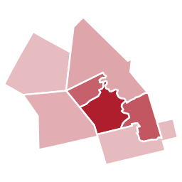

```{=html}
<!-- The site card, as live text rather than the picture of it.
     images/social-card.png says the same thing, but its type is drawn at a fixed
     1200px wide: on a phone the strapline would land at about seven pixels tall.
     Set as HTML it reflows, and the wording only has to be kept in step with
     _quarto.yml's `description` and the card_text() calls in _dev/logo/make_logo.R.
     custom.scss hides Quarto's own title block here and styles the <h1> below, so
     that the card sits above the heading instead of underneath it. -->
<div class="cwr-hero">
  <div class="cwr-hero-text">
    <p class="cwr-hero-name">Charting<br>Waterloo Region</p>
    <p class="cwr-hero-tagline">Charts and analysis about life in Waterloo Region, built from open data.</p>
  </div>
  
</div>

<h1 class="title">About</h1>
```

## What this is

Charting Waterloo Region uses open data to answer plain questions about the place we live: how safe is it, how well do city services work, how is the region changing. Each post takes one question, finds the best available public data, and shows what the numbers say in a handful of carefully made charts.

Every chart is built in R and every post can be reproduced from the code and data in the [GitHub repository](https://github.com/gpberber/chartingwaterlooregion). See [Reproduce a post](reproduce.qmd) for the steps.

## Two kinds of post

- **Snapshot.** A few charts and some basic analysis, readable in under five minutes.
- **Deep dive.** Many charts and more detailed analysis, taking a lot more than five minutes.

Every post is labelled with one or the other, and the categories list on the [Posts](index.qmd) page filters by kind or by topic.

## Who writes it

Posts are written by Greg Berberich.

```{=html}
<!-- TODO: add a short bio (background, why this region, why open data). The image
     at the top is the site mark (images/logo-mark.svg); swap it for a photo if you
     would rather have one here. -->
```

## How the posts are made

- **Sources are public.** Statistics Canada tables, municipal open-data portals, published reports. Each post lists its sources, with links and licences, in a data section at the end.
- **Charts follow one style.** Direct labels instead of legends, no chart junk, the same three colours throughout: blue for Waterloo Region, red for a comparison such as Canada, grey for context.
- **Nothing is hidden.** The code, the cleaned data, and the rendered results all live in the repository. Large files are attached to GitHub Releases so anyone can download them.
- **Everything is reusable.** Text and charts are published under [CC BY 4.0](https://creativecommons.org/licenses/by/4.0/): copy, share, or republish them, including in the news, with credit to Charting Waterloo Region. The code is [MIT licensed](https://github.com/gpberber/chartingwaterlooregion/blob/master/LICENSE). Data stays under the licence of whoever published it.

## How the site is built

The analysis and the charts are [R](https://www.r-project.org): [ggplot2](https://ggplot2.tidyverse.org) for the charts, [gt](https://gt.rstudio.com) for the tables, and [sf](https://r-spatial.github.io/sf/) when there is a map. [Quarto](https://quarto.org) turns that code, and the writing around it, into the pages you are reading.

The pages are built on my own computer rather than by a server, so what reaches you is plain HTML, CSS and images: no database, no code running behind the scenes, nothing to sign in to. GitHub Pages serves them, and both the source and the rendered output live in the [GitHub repository](https://github.com/gpberber/chartingwaterlooregion).

## Privacy

This site counts page views so I know which posts people find useful. The counter sets no cookies, records nothing that identifies you, and is not run by an advertising company. There is nothing to opt out of and nothing to click away.

## Contact and corrections

Spotted an error or have a question about the data? Email [greg\@chartingwaterlooregion.ca](mailto:greg@chartingwaterlooregion.ca). Corrections are welcome and are made in public: if a post changes after publication, the change is noted in the post.
