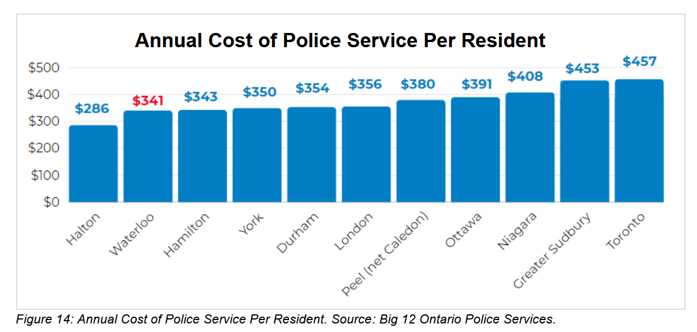

```{r load-libraries, include=FALSE, cache=TRUE}
here::i_am("datasets/crime/R/exploration/explore.Rmd")

library(tidyverse)
library(arrow)
library(DataExplorer)
library(scales)
library(here)
library(gt)
library(tidytext)
library(janitor)
library(cansim)
library(ggrepel)
library(broom)
library(gtExtras)
library(sandwich)
library(lmtest)
library(mediation)
library(conflicted)
library(ggtext)
library(corrr)
library(showtext)

# font_add_google("Roboto", "Roboto")  # Downloads if needed
# showtext_opts(dpi = 225)  # Add this line
# showtext_auto()
conflicts_prefer(dplyr::filter, dplyr::select, dplyr::mutate, dplyr::lag)

number_options(big.mark = "")
```

```{r load-data}
incidents <- read_parquet(here("datasets", "crime", "data", "criminal_incidents.parquet"))

incident_totals <- read_parquet(here("datasets", "crime", "data", "criminal_incident_totals.parquet"))

incident_summary <-  read_rds(here("datasets", "crime", "data", "criminal_incident_summary.rds"))

csi <- read_rds(here("datasets", "crime", "data", "crime_severity_index.rds"))

homicide_victims <- read_rds(here("datasets", "crime", "data", "homicide_victims.rds"))

hate_crimes <- read_rds(here("datasets", "crime", "data", "hate_crimes.rds"))

cyber_crimes <- read_rds(here("datasets", "crime", "data", "cyber_crimes.rds"))

personnel <- read_rds(here("datasets", "crime", "data", "personnel.rds"))

big_12_financials <- read_rds(here("datasets", "crime", "data", "big_12_financial_summary.rds"))
```

```{r create-ggplot-themes, include=FALSE, cache=TRUE}
# Create the Tufte-inspired theme
theme_tufte <- function(base_size = 13, base_family = "") {
  theme_minimal(base_size = base_size, base_family = base_family) +
    theme(
      # Text elements
      plot.title = element_markdown(
        size = base_size * 1.1,
        hjust = 0,
        vjust = 1,
        margin = margin(0, 0, 5, 0),
        face = "bold"
      ),
      plot.subtitle = element_markdown(
        size = base_size * 0.9,
        hjust = 0,
        vjust = 1,
        margin = margin(0, 0, 10, 0),
        color = "black",
        face = "bold"
      ),
      plot.caption = element_markdown(
        size = base_size * 0.8,
        hjust = 0,
        vjust = 1,
        margin = margin(t = 10),
        color = "grey50"
      ),

      # Axis elements - minimal but functional
      axis.title.x = element_blank(),
      axis.title.y = element_blank(),
      axis.text.x = element_text(
        size = base_size * 0.85,
        margin = margin(t = base_size * 0.25)
      ),
      axis.text.y = element_markdown(
        size = base_size * 0.85,
        margin = margin(r = base_size * 0.25),
        hjust = 0
      ),

      # Minimal axis lines - only where data meets axis
      axis.line.x = element_line(
        color = "black",
        linewidth = 0.5,
        linetype = "solid"
      ),
      axis.line.y = element_blank(),

      # Axis ticks
      axis.ticks.x = element_line(color = "black", linewidth = 0.5),
      axis.ticks.length.x = unit(0.15, "cm"),
      axis.minor.ticks.length = rel(0.5),

      # Gridlines
      panel.grid.major.y = element_line(
        color = "grey80",
        linewidth = 0.3
      ),
      panel.grid.major.x = element_blank(),
      panel.grid.minor.x = element_blank(),
      panel.grid.minor.y = element_blank(),

      # Legend - clean and minimal
      legend.position = "inside",
      legend.position.inside = c(-0.0, 1.02),
      legend.justification = "left",
      legend.box = "horizontal",
      #legend.margin = margin(t = 20, b = 20),
      legend.direction = "horizontal",
      legend.title = element_blank(),
      legend.text = element_text(
        size = base_size * 0.75,
        margin = margin(r = 10)
      ),
      #legend.key = element_blank(),
      legend.spacing = unit(0.1, "cm"),
      legend.box.spacing = unit(0.1, "cm"),

      # Faceting - minimal
      strip.text = element_text(
      hjust = 0,
      size = base_size * 0.8,
      margin = margin(b = base_size * 0.5),
      face = "bold"
      ),
      strip.background = element_blank(),
      panel.spacing.y = unit(1.5, "lines"),

      # Plot settings - left justify all
      plot.margin = margin(
        t = base_size,
        r = base_size,
        b = base_size,
        l = base_size
      ),
      # plot.title.position = "plot",
      # plot.caption.position = "plot",

      # Remove panel border
      panel.border = element_blank(),

      # Background
      plot.background = element_rect(fill = "white", color = NA),
      panel.background = element_rect(fill = "white", color = NA)
    )
}

# Set as the default theme for all plots
theme_set(theme_tufte(base_size = 13, base_family = "")
  )

#base_size <- 13

```

```{r plot-incidents-vs-Can-Ont}
incident_summary |>
  filter(str_detect(region, "WRPS|Canada|Ontario")) |> 
  ggplot(aes(x = year, y = incidents_per_100k_all, colour = region)) +
  geom_line(linewidth = 1.1) +
  scale_color_manual(
    values = c("Canada" = "deepskyblue", "Ontario" = "grey50", "WRPS" = "dodgerblue3")
  ) +
  scale_x_continuous(
    breaks = c(seq(2000, 2020, 5), 2024),
    minor_breaks = seq(2000, 2024, 1),
    expand = expansion(mult = c(0.02, 0.08))
  ) +
  guides(x = guide_axis(minor.ticks = TRUE)) +
  
  theme(
    legend.position.inside = c(0, 1.02)
  ) +
  labs(
    title = "Number of Criminal Incidents: 2000-2024",
    subtitle = "Per 100,000 population<br>",
    caption = "Source: Data source | *Charting Waterloo Region*"
  )  
```

```{r intro-incidents}
incidents |> 
  introduce() |> 
  pivot_longer(everything()) |> 
  gt()
```

```{r plot-intro-incidents}
plot_intro(incidents)
```

```{r plot-missing-incidents}
plot_missing(incidents)
```

```{r prop-na-diverted-charged}
incidents |> 
  filter(incidents > 0) |> 
  select(year, contains("charged_"), contains("diverted_"), contains("unfounded"), clearance_rate, perc_contribution_to_csi) |> 
  group_by(year) |> 
  summarise(across(everything(), ~ mean(is.na(.x))), .groups = "drop") |> 
  pivot_longer(2:last_col(), 
               names_to = "column", 
               values_to = "na_proportion") |> 
  filter(na_proportion > 0) |> 
  arrange(column, year) |> 
  ggplot(aes(x = year, y = na_proportion)) +
  geom_col() +
  scale_x_continuous(breaks = seq(1998, 2024, 1)) +
  coord_flip() +
  facet_wrap(~ column, ncol = 3, scales = "free_y")
```

```{r na-perc-cont-csi}
incidents |> 
  filter(incidents > 0) |> 
  select(year, incidents, perc_contribution_to_csi) |>
  mutate(na_value = is.na(perc_contribution_to_csi)) |> 
  group_by(year, na_value) |> 
  summarise(min_incidents = min(incidents), max_incidents = max(incidents), mean_incidents = mean(incidents), .groups = "drop")
```

```{r yoy-change-inc-per-100k-by-region}
incidents |> 
  filter(year > 1998) |> 
  select(region, incidents_per_100k, yoy_change_incidents_per_100k) |> 
  group_by(region) |> 
  summarize(
    mean_inc = mean(incidents_per_100k, na.rm = TRUE),
    prop_na_yoy = mean(is.na(yoy_change_incidents_per_100k))        
    )
```

```{r na-yoy-change-inc-per-100k}
incidents |> 
  select(year, violation_master, incidents_per_100k, yoy_change_incidents_per_100k) |>
  group_by(violation_master) |> 
  mutate(py_incidents_per_100k = lag(incidents_per_100k)) |> 
  ungroup() |> 
  filter(
    py_incidents_per_100k > 0, 
    #is.na(yoy_change_incidents_per_100k), 
    !is.na(incidents_per_100k)
  ) |> 
  mutate(yoy_isna = is.na(yoy_change_incidents_per_100k)) |> 
  group_by(year, yoy_isna) |> 
  summarise(min_incidents = min(incidents_per_100k), min_py_incidents = min(py_incidents_per_100k)) #|> 
  # filter(yoy_isna == 0) |> 
  #arrange(min_incidents)
```

```{r intro-incidents-total}
incident_totals |> 
  introduce() |> 
  pivot_longer(everything()) |> 
  gt()
```

```{r plot-missing-incidents-totals}
plot_missing(incident_totals)
```

```{r intro-csi}
csi |> 
  introduce() |> 
  pivot_longer(everything()) |> 
  gt()
```

```{r plot-missing-csi}
plot_missing(csi)
```

```{r intro-homicides}
homicide_victims |> 
  introduce() |> 
  pivot_longer(everything()) |> 
  gt()
```

```{r plot-intro-homicides}
plot_intro(homicide_victims)
```

```{r plot-missing-homicides}
plot_missing(homicide_victims)
```

```{r intro-hate-crimes}
hate_crimes |> 
  introduce() |> 
  pivot_longer(everything()) |> 
  gt()
```

```{r plot-intro-hate-crimes}
plot_intro(hate_crimes)
```

```{r plot-missing-hate-crimes}
plot_missing(hate_crimes)
```

[Police-Reported Crime Statistics in Canada, 2024 - Stats Can Analysis](https://www150.statcan.gc.ca/n1/daily-quotidien/250722/dq250722a-eng.htm)

```{r plot_hom-victims-cma}
homicide_victims |>
  filter(province == "Canada") |>
  ggplot(aes(x = year, y = incidents_per_100k, colour = city)) +
  geom_line(linewidth = 1) +
  # Add vertical lines for party changes
  geom_vline(xintercept = 1960, linetype = "dashed", alpha = 0.7, colour = "gray50") +
  geom_vline(xintercept = 1968, linetype = "dashed", alpha = 0.7, colour = "gray50") +
  geom_vline(xintercept = 1979, linetype = "dashed", alpha = 0.7, colour = "gray50") +
  geom_vline(xintercept = 1980, linetype = "dashed", alpha = 0.7, colour = "gray50") +
  geom_vline(xintercept = 1984, linetype = "dashed", alpha = 0.7, colour = "gray50") +
  geom_vline(xintercept = 1993, linetype = "dashed", alpha = 0.7, colour = "gray50") +
  geom_vline(xintercept = 2006, linetype = "dashed", alpha = 0.7, colour = "gray50") +
  geom_vline(xintercept = 2015, linetype = "dashed", alpha = 0.7, colour = "gray50") +
  # Add annotations for party in power
  annotate("text", x = 1964, y = 3.1, label = "PC", size = 3, colour = "black") +
  annotate("text", x = 1973.5, y = 3.1, label = "Liberal", size = 3, colour = "black") +
  annotate("text", x = 1979.5, y = 3.1, label = "PC", size = 3, colour = "black") +
  annotate("text", x = 1982, y = 3.1, label = "Liberal", size = 3, colour = "black") +
  annotate("text", x = 1988.5, y = 3.1, label = "PC", size = 3, colour = "black") +
  annotate("text", x = 1999.5, y = 3.1, label = "Liberal", size = 3, colour = "black") +
  annotate("text", x = 2010.5, y = 3.1, label = "Conservative", size = 3, colour = "black") +
  annotate("text", x = 2019.5, y = 3.1, label = "Liberal", size = 3, colour = "black") +
  scale_x_continuous(
    breaks = c(seq(1960, 2024, 5), 2024),
    labels = label_number(),
    minor_breaks = seq(1960, 2024, 1),
    expand = expansion(mult = c(0.02, 0.05))
  ) +
  guides(x = guide_axis(minor.ticks = TRUE)) +
  
  labs(
    title = "Number of Homicide Victims in Canada, per 100,000 people: 1961-2024",
    subtitle = "Including breakdown between Census Metropolitan Areas and Non-CMAs for 1981-2024<br>",
    caption = "Source: Data source | Analysis: Your Name"
  ) 
```

```{r create-big-12-tibble}
big_12 <- personnel |> 
  filter(region %in% c("Canada", "Ontario") | in_big_12) |> 
  mutate(comparison_group = if_else(region %in% c("Canada", "Ontario", "WRPS"), region, "Other Big 12")) 

big_12_join <- big_12 |> 
  select(geo_uid, in_big_12, comparison_group) |> 
  distinct()

csi <- csi |> 
  left_join(big_12_join, join_by(geo_uid))

incident_summary <- incident_summary |> 
  left_join(big_12_join, join_by(geo_uid))

incident_totals <- incident_totals |> 
  left_join(big_12_join, join_by(geo_uid))

incidents <- incidents |> 
  left_join(big_12_join, join_by(geo_uid))

big_12_financials <- big_12_financials |> 
  left_join(big_12_join |> select(-in_big_12), join_by(geo_uid))

comp_colours <- c(
  "WRPS" = "dodgerblue3",
  "Canada" = "darkred",
  "Ontario" = "darkgreen",
  "Other Big 12" = "lightgrey"
)

latest_year_csi <- max(csi$year)
latest_year_incidents <- max(incidents$year)
latest_year_personnel <- max(personnel$year)
latest_year_financials <- max(big_12_financials$year)
```

```{r plot-csi-vs-Can-Ont}
csi |>
  filter(str_detect(region, "WRPS|Canada|Ontario")) |> 
  ggplot(aes(x = year, y = csi, colour = region)) +
  geom_line(linewidth = 1.1) +
  
  scale_x_continuous(
    breaks = c(seq(2000, 2024, 5), 2024),
    labels = label_number(big.mark = ""),
    minor_breaks = seq(2000, 2024, 1),
    expand = expansion(mult = c(0.02, 0.05)),
    position = "bottom"
  ) +
  
  scale_y_continuous(
      position = "right",
      breaks = pretty_breaks(),
      labels = label_number()
  ) +
  
  guides(x = guide_axis(minor.ticks = TRUE)) +
  
  theme(
      axis.text.y.right = element_text(
        size = rel(0.85),
        hjust = 1.0,
        vjust = -0.5,  # Shifts labels up above gridlines
        margin = margin(l = -18)  # Move labels left to sit on gridline ends
      ),
      legend.position.inside = c(-0.0, 1.02)
    ) +
  
  labs(
      title = "Crime Severity Index",
      subtitle = "2000-2024<br>",
      caption = "Source: Source | *Charting Waterloo Region*"
  )

```

```{r plot-incidents-local}
local_cities <- c("WRPS", "Guelph", "Hamilton", "London")

incident_summary |>
  filter(region %in% local_cities) |> 
  ggplot(aes(x = year, y = incidents_per_100k_all, colour = region)) +
  geom_line(linewidth = 0.8) +
  geom_point(size = 1) +
  scale_y_continuous(
    breaks = pretty_breaks(),
    labels = label_comma()
  ) +
  labs(
    title = "Number of Criminal Incidents: 2000-2024",
    subtitle = "Per 100,000 population<br><br>",
    caption = "Source: Data source | Analysis: Your Name"
  ) 
```

```{r plot-csi-local}
csi |>
  filter(region %in% local_cities) |> 
  ggplot(aes(x = year, y = csi, colour = region)) +
  geom_line(linewidth = 1.1) +
  
  scale_x_continuous(
    breaks = c(seq(2000, 2020, 5), 2024),
    minor_breaks = seq(2000, 2024, 1),
    expand = expansion(mult = c(0.02, 0.05))
  ) +
  guides(x = guide_axis(minor.ticks = TRUE)) +
  labs(
    title = "Crime Severity Index: 2000-2024",
    subtitle = "<br>",
    caption = "Source: Data source | Analysis: Your Name"
  ) 
```

```{r plot-violent-incidents-vs-Can-Ont}
incident_summary |>
  filter(str_detect(region, "WRPS|Canada|Ontario")) |> 
  ggplot(aes(x = year, y = incidents_per_100k_violent, colour = region)) +
  geom_line(linewidth = 0.8) +
  geom_point(size = 1) +
  scale_y_continuous(
    breaks = pretty_breaks(),
    labels = label_comma()
  ) +
  theme(
    panel.grid.major = element_line(
      color = "grey90", 
      linewidth = 0.3
    )
  ) +
  labs(
    title = "Number of Violent Criminal Incidents: 2000-2024",
    subtitle = "Per 100,000 population",
    x = "",
    y = "",
    caption = "Source: Data source | Analysis: Your Name"
  ) 
```

```{r violent-incidents--top10-increases-2014-2024}
incidents_2024_v_2014 <- incidents |>
  group_by(region, type, violation_master) |>
  summarise(
    incidents_per_100k_2014 = sum(incidents_per_100k[year == 2014], na.rm = TRUE),
    incidents_per_100k_2024 = sum(incidents_per_100k[year == 2024], na.rm = TRUE),
    .groups = "drop"
  ) |>
  mutate(
    change_vs_2014 = incidents_per_100k_2024 - incidents_per_100k_2014,
    perc_change_vs_2014 = case_when(
      incidents_per_100k_2014 == 0 ~ "Zero in 2014",  # Avoid division by zero
      TRUE ~ as.character(round(change_vs_2014 / incidents_per_100k_2014 * 100, 1))
    )
  ) |>
  arrange(region, type, desc(change_vs_2014))

incidents_2024_v_2014 |> 
  filter(
    region == "WRPS",
    type == "Violent"
  ) |> 
  slice_max(n = 10, order_by = change_vs_2014) |> 
  mutate(violation_master = reorder(violation_master, change_vs_2014)) |>
  ggplot(aes(x = change_vs_2014, y = violation_master)) +
    geom_segment(aes(
      x = 0, xend = change_vs_2014,
      y = violation_master,
      yend = violation_master),
      color = "black", linewidth = 0.7) +

  # Add the dots - 
    geom_point(
      aes(
        x = change_vs_2014,
        y = violation_master
      ),
      shape = 19, size = 4,
      color = "dodgerblue3"
    ) +
    scale_x_continuous(position = "top", breaks = seq(0, 250, 25)) +
    geom_vline(xintercept = 0, color = "black", linewidth = 0.5) +
    labs(
      title = "Top 10 Increases in Violent Crime",
      subtitle = "Increase in incidents per 100,000 residents, Waterloo Region, 2024 vs 2014",
      caption = "Source: Source | *Charting Waterloo Region*"
    ) +
  theme(
    panel.grid.major.x = element_line(color = "grey80", linewidth = 0.3),
    axis.ticks.x = element_blank(),
    axis.line.x = element_blank(),
    axis.text.x = element_text(margin = margin(t = 0, b = 1))
  )
```

```{r plot-nonviolent-crimes-wrps-top10-increases-2024-vs-2014}
incidents_2024_v_2014 |> 
  filter(
    region == "WRPS",
    type == "Non-Violent"
  ) |> 
  slice_max(n = 10, order_by = change_vs_2014) |> 
  mutate(violation_master = reorder(violation_master, change_vs_2014)) |>
  ggplot(aes(x = change_vs_2014, y = violation_master)) +
    geom_segment(aes(
      x = 0, xend = change_vs_2014,
      y = violation_master,
      yend = violation_master),
      color = "black", linewidth = 0.7) +

  # Add the dots - 
    geom_point(
      aes(
        x = change_vs_2014,
        y = violation_master
      ),
      shape = 19, size = 4,
      color = "dodgerblue3"
    ) +
    scale_x_continuous(position = "top", breaks = seq(0, 250, 25)) +
    geom_vline(xintercept = 0, color = "black", linewidth = 0.5) +
    labs(
      title = "Top 10 Increases in Non-Violent Crime",
      subtitle = "Increase in incidents per 100,000 residents, Waterloo Region, 2024 vs 2014",
      caption = "Source: Source | *Charting Waterloo Region*"
    ) +
    theme(
      axis.line.x = element_blank(),
      axis.ticks.x = element_blank(),
      axis.text.x = element_text(margin = margin(t = 0, b = 1)),
      panel.grid.major.x = element_line(
        color = "grey80", 
        linewidth = 0.3
      )
    ) 

```

```{r vehicle-theft-base-wrps}
incidents |> 
  filter(
    region %in% c("Canada", "Ontario", "WRPS"),
    violation_master == "Motor Vehicle Theft"
  ) |> 
  group_by(region) |> 
  mutate(base_incidents = incidents_per_100k / first(incidents_per_100k, order_by = year) * 100) |> 
  ungroup() |> 
  ggplot(aes(x = year, y = base_incidents, color = region)) +
    geom_line(linewidth = 1.1) +
    labs(
      title = "Motor Vehicle Theft",
      subtitle = "Change in incidents per 100,000 residents, 2000 = 100<br>",
      caption = "Source: Data source | Analysis: Your Name"
    ) +
  theme(
    legend.position.inside = c(-0.05, 1.05)
  ) +
  
  scale_x_continuous(
    breaks = c(seq(2000, 2024, 5), 2024),
    labels = label_number(),
    minor_breaks = seq(2000, 2024, 1),
    expand = expansion(mult = c(0.02, 0.05)),
    position = "bottom"
  ) +
  guides(x = guide_axis(minor.ticks = TRUE)) 
```

```{r vehicle-theft-wrps}
incidents |> 
  filter(
    region %in% c("Canada", "Ontario", "WRPS"),
    violation_master == "Motor Vehicle Theft"
  ) |> 
  ggplot(aes(x = year, y = incidents_per_100k, color = region)) +
    geom_line(linewidth = 0.8) +
    scale_y_continuous(breaks = pretty_breaks()) +
    labs(
      title = "Motor Vehicle Theft",
      subtitle = "Incidents per 100,000 residents",
      x = "",
      y = "",
      caption = "Source: Data source | Analysis: Your Name | no data for 2020"
    ) 
```

```{r abduction-under-14-wrps}
incidents |> 
  filter(
    region == "WRPS",
    str_detect(violation_master, "Abduction Under 14")
  ) |> 
  mutate(
    violation_master = str_replace_all(violation_master, c(
      "Abduction Under 14,* " = "",
      "by" = "By",
      "Not" = "Not by")
    )) |> 
  ggplot(aes(x = year, y = incidents_per_100k)) +
    geom_col(fill = 'dodgerblue3') +
    facet_wrap(
      ~ violation_master,
      ncol = 1
    ) +
    scale_y_continuous(
      position = "right",
      breaks = pretty_breaks(),
      sec.axis = dup_axis(labels = NULL)  # This creates labels on the right edge
    ) +
    scale_x_continuous(
      breaks = c(2000, 2005, 2010, 2015, 2020, 2024),
      expand = expansion(mult = c(0, 0.05), add = c(0, 0))
    ) +
    labs(
      title = "Abductions Under 14",
      subtitle = "Incidents per 100,000 residents",
      x = NULL,
      y = NULL,
      caption = "Source: Data source | Analysis: Your Name"
    ) +
  theme(
      axis.text.y.right = element_text(
      hjust = 1.0,
      vjust = -0.5,
      margin = margin(l = -15)  # Move labels left to sit on gridline ends
    )
  )
```

```{r plot-csi-violent-incidents-vs-Can-Ont}
csi |>
  filter(str_detect(region, "WRPS|Canada|Ontario")) |> 
  ggplot(aes(x = year, y = csi_violent, colour = region)) +
  geom_line(linewidth = 0.8) +
  geom_point(size = 1) +
  scale_y_continuous(
    breaks = pretty_breaks(),
    labels = label_comma()
  ) +
  theme(
    panel.grid.major = element_line(
      color = "grey90", 
      linewidth = 0.3
    )
  ) +
  labs(
    title = "Violent Crime Severity Index: 2000-2024",
    subtitle = "",
    x = "",
    y = "",
    caption = "Source: Data source | Analysis: Your Name"
  ) 
```

```{r plot-csi-violent-incidents-vs-Can-Ont-yoy}
csi |>
  filter(str_detect(region, "WRPS|Canada|Ontario")) |> 
  ggplot(aes(x = year, y = yoy_perc_change_csi_violent, colour = region)) +
  geom_line(linewidth = 0.8) +
  geom_point(size = 1) +
  scale_y_continuous(
    breaks = pretty_breaks(),
    labels = label_comma()
  ) +
  theme(
    panel.grid.major = element_line(
      color = "grey90", 
      linewidth = 0.3
    )
  ) +
  labs(
    title = "Violent Crime Severity Index: 2000-2024",
    subtitle = "Year-over-year change, %",
    x = "",
    y = "",
    caption = "Source: Data source | Analysis: Your Name"
  ) 
```

```{r plot-violent-incidents-local}
incident_summary |>
  filter(
     region %in% local_cities
  ) |> 
  ggplot(aes(x = year, y = incidents_per_100k_violent, colour = region)) +
  geom_line(linewidth = 0.8) +
  geom_point(size = 1) +
  scale_y_continuous(
    breaks = pretty_breaks(),
    labels = label_comma()
  ) +
  theme(
    panel.grid.major = element_line(
      color = "grey90", 
      linewidth = 0.3
    )
  ) +
  labs(
    title = "Number of Violent Criminal Incidents: 2000-2024",
    subtitle = "Per 100,000 population",
    x = "",
    y = "",
    caption = "Source: Data source | Analysis: Your Name"
  ) 
```

```{r plot-csi-violent-incidents-local}
csi |>
  filter(
   region %in% local_cities
  ) |> 
  ggplot(aes(x = year, y = csi_violent, colour = region)) +
  geom_line(linewidth = 0.8) +
  geom_point(size = 1) +
  scale_y_continuous(
    breaks = pretty_breaks(),
    labels = label_comma()
  ) +
  theme(
    panel.grid.major = element_line(
      color = "grey90", 
      linewidth = 0.3
    )
  ) +
  labs(
    title = "Violent Crime Severity Index: 2000-2024",
    subtitle = "",
    x = "",
    y = "",
    caption = "Source: Data source | Analysis: Your Name"
  ) 
```

```{r plot-nonviolent-incidents-vs-Can-Ont}
incident_summary |>
  filter(
    str_detect(region, "WRPS|Canada|Ontario")
  ) |> 
  ggplot(aes(x = year, y = incidents_per_100k_nonviolent, colour = region)) +
  geom_line(linewidth = 0.8) +
  geom_point(size = 1) +
  scale_y_continuous(
    breaks = pretty_breaks(),
    labels = label_comma()
  ) +
  theme(
    panel.grid.major = element_line(
      color = "grey90", 
      linewidth = 0.3
    )
  ) +
  labs(
    title = "Number of Non-Violent Criminal Incidents: 2000-2024",
    subtitle = "Per 100,000 population",
    x = "",
    y = "",
    caption = "Source: Data source | Analysis: Your Name"
  ) 
```

```{r plot-csi-nonviolent-vs-Can-Ont}
csi |>
  filter(
    str_detect(region, "WRPS|Canada|Ontario")
  ) |> 
  ggplot(aes(x = year, y = csi_nonviolent, colour = region)) +
  geom_line(linewidth = 0.8) +
  geom_point(size = 1) +
  scale_y_continuous(
    breaks = pretty_breaks(),
    labels = label_comma()
  ) +
  theme(
    panel.grid.major.y = element_line(
      color = "grey90", 
      linewidth = 0.3
    )
  ) +
  labs(
    title = "Non-Violent Crime Severity Index: 2000-2024",
    subtitle = "",
    x = "",
    y = "",
    caption = "Source: Data source | Analysis: Your Name"
  ) 
```

```{r plot-nonviolent-incidents-local}
incident_summary |>
  filter(
    region %in% local_cities
  ) |> 
  ggplot(aes(x = year, y = incidents_per_100k_nonviolent, colour = region)) +
  geom_line(linewidth = 0.8) +
  geom_point(size = 1) +
  scale_y_continuous(
    breaks = pretty_breaks(),
    labels = label_comma()
  ) +
  theme(
    panel.grid.major = element_line(
      color = "grey90", 
      linewidth = 0.3
    )
  ) +
  labs(
    title = "Number of Non-Violent Criminal Incidents: 2000-2024",
    subtitle = "Per 100,000 population",
    x = "",
    y = "",
    caption = "Source: Data source | Analysis: Your Name"
  ) 
```

```{r plot-csi-nonviolent-local}
csi |>
  filter(
    region %in% local_cities
  ) |> 
  ggplot(aes(x = year, y = csi_nonviolent, colour = region)) +
  geom_line(linewidth = 0.8) +
  geom_point(size = 1) +
  scale_y_continuous(
    breaks = pretty_breaks(),
    labels = label_comma()
  ) +
  theme(
    panel.grid.major = element_line(
      color = "grey90", 
      linewidth = 0.3
    )
  ) +
  labs(
    title = "Non-Violent Crime Severity Index: 2000-2024",
    subtitle = "",
    x = "",
    y = "",
    caption = "Source: Data source | Analysis: Your Name"
  ) 

```

```{r plot-big12-ranked-incidents}
incident_summary |>
  filter(
    in_big_12,
    year == latest_year_incidents
  ) |>
  select(region, comparison_group, incidents_per_100k_all, incidents_per_100k_violent, incidents_per_100k_nonviolent) |>
  # Reshape to long format for easier plotting
  pivot_longer(
    cols = c(incidents_per_100k_all, incidents_per_100k_violent, incidents_per_100k_nonviolent),
    names_to = "metric",
    values_to = "value"
  ) |>
  # Create better labels for metrics
  mutate(
    metric_label = case_when(
      metric == "incidents_per_100k_all" ~ "Total",
      metric == "incidents_per_100k_violent" ~ "Violent", 
      metric == "incidents_per_100k_nonviolent" ~ "Non-Violent"
    ),
    metric_label = factor(metric_label, levels = c("Total", "Violent", "Non-Violent"))
  ) |>
  # Rank regions within each metric (descending order)
  group_by(metric) |>
  mutate(region = reorder_within(region, value, metric)) |>
  ungroup() |>
  ggplot(aes(x = value, y = region, fill = comparison_group)) +
  geom_col() +
  scale_y_reordered() +
  facet_wrap(
    ~ metric_label,
    ncol = 3,
    scales = "free"
  ) +
  geom_text(
    aes(label = comma(value, accuracy = 1)),
    position = position_dodge(width = 0.9),
    hjust = 1.2,
    color = "white",
    size = 3.5,
    fontface = "bold"
  ) +
  labs(
    title = "Criminal Incidents: 2024",
    subtitle = "per 100,000 residents",
    x = "",
    y = "",
    caption = "Source: Statistics Canada | Analysis: Your analysis"
  ) +
  theme(
    axis.line.x = element_blank(),
    axis.line.y = element_blank(),
    axis.text.x = element_blank(),
    axis.text.y = element_markdown(hjust = 1),
    legend.title = element_blank()
  ) +
  scale_fill_manual(
    values = c("WRPS" = "dodgerblue3", "Other Big 12" = "grey60")
  )
```

```{r plot-big12-ranked-csi}
csi |>
  filter(
    in_big_12,
    year == latest_year_csi
  ) |>
  select(region, comparison_group, csi, csi_violent, csi_nonviolent) |>
  # Reshape to long format for easier plotting
  pivot_longer(
    cols = c(csi, csi_violent, csi_nonviolent),
    names_to = "metric",
    values_to = "value"
  ) |>
  # Create better labels for metrics
  mutate(
    metric_label = case_when(
      metric == "csi" ~ "All",
      metric == "csi_violent" ~ "Violent", 
      metric == "csi_nonviolent" ~ "Non-Violent"
    ),
    metric_label = factor(metric_label, levels = c("All", "Violent", "Non-Violent"))
  ) |>
  # Rank regions within each metric (descending order)
  group_by(metric) |>
  mutate(region = reorder_within(region, value, metric)) |>
  ungroup() |>
  ggplot(aes(x = value, y = region, fill = comparison_group)) +
  geom_col() +
  scale_y_reordered() +
  facet_wrap(
    ~ metric_label,
    ncol = 3,
    scales = "free"
  ) +
  geom_text(
    aes(label = comma(value, accuracy = 0.1)),
    position = position_dodge(width = 0.9),
    hjust = 1.2,
    color = "white",
    size = 3.5,
    fontface = "bold"
  ) +
  labs(
    title = "Crime Severity Index: 2024",
    subtitle = "",
    x = "",
    y = "",
    caption = "Source: Statistics Canada | Analysis: Your analysis"
  ) +
  theme(
    panel.grid.major = element_blank(),
    axis.line.x = element_blank(),
    axis.line.y = element_blank(),
    axis.text.x = element_blank(),
    axis.text.y = element_markdown(hjust = 1)
  ) +
  scale_fill_manual(
    values = c("WRPS" = "dodgerblue3", "Other Big 12" = "grey60")
  )
```

```{r plot-big12-ranked-officers-per-incident}
big_12 |>
  filter(
    in_big_12,
    year == latest_year_personnel
  ) |>
  select(region, comparison_group, incidents_per_officer, incidents_per_officer_violent, incidents_per_officer_nonviolent) |>
  # Reshape to long format for easier plotting
  pivot_longer(
    cols = c(3:5),
    names_to = "metric",
    values_to = "value"
  ) |>
  # Create better labels for metrics
  mutate(
    metric_label = case_when(
      metric == "incidents_per_officer" ~ "All Crimes",
      metric == "incidents_per_officer_violent" ~ "Violent Crimes", 
      metric == "incidents_per_officer_nonviolent" ~ "Non-Violent Crimes"
    ),
    metric_label = factor(metric_label, levels = c("All Crimes", "Violent Crimes", "Non-Violent Crimes"))
  ) |>
  # Rank regions within each metric (descending order)
  group_by(metric) |>
  mutate(region = reorder_within(region, value, metric)) |>
  ungroup() |>
  ggplot(aes(x = value, y = region, fill = comparison_group)) +
  geom_col() +
  scale_y_reordered() +
  facet_wrap(
    ~ metric_label,
    ncol = 3,
    scales = "free"
  ) +
  geom_text(
    aes(label = comma(value, accuracy = 0.1)),
    position = position_dodge(width = 0.9),
    hjust = 1.2,
    color = "white",
    size = 3.5,
    fontface = "bold"
  ) +
  labs(
    title = "Incidents per Officer: 2023",
    subtitle = "",
    x = "",
    y = "",
    caption = "Source: Statistics Canada | Analysis: Your analysis"
  ) +
  theme(
    axis.line.x = element_blank(),
    axis.line.y = element_blank(),
    axis.text.x = element_blank(),
    axis.text.y = element_markdown(hjust = 1),
    legend.title = element_blank()
  ) +
  scale_fill_manual(
    values = c("WRPS" = "dodgerblue3", "Other Big 12" = "grey60")
  )
```

From 2024 WRPS Budget Information Package (Windsor is missing; year not noted, but WRPS number is close to my number calculated for 2022 based on 2022 WRPS Annual Report figures)



```{r plot-csi-clearance-wrps, fig.height=10, fig.width=8}
csi |> 
  filter(region == "WRPS") |> 
  # Select the base columns and pivot them longer
  select(year, base_csi:base_clearance_rate_nonviolent) |> 
  pivot_longer(
    cols = base_csi:base_clearance_rate_nonviolent,
    names_to = "metric",
    values_to = "base_rate"
  ) |> 
  # Create the type column based on the metric name
  mutate(
    type = case_when(
      str_detect(metric, "_violent$") ~ "Violent Crimes",
      str_detect(metric, "_nonviolent$") ~ "Non-violent Crimes", 
      TRUE ~ "All Crimes"
    ),
    # Create the statistic column
    statistic = case_when(
      str_detect(metric, "base_csi") ~ "CSI",
      str_detect(metric, "base_clearance_rate") ~ "Clearance Rate"
    )
  ) |> 
  # Remove rows where statistic is NA (shouldn't happen but just in case)
  filter(!is.na(statistic)) |> 
  arrange(type, year) |> 
  ggplot(aes(x = year, y = base_rate, colour = statistic)) +
  geom_line(linewidth = 0.9) +
  geom_text(
    data = . %>% 
      filter(year == 2006, type == "All Crimes"),  # Only 2004 values in "All Crimes" facet
    aes(label = statistic, x = year, y = base_rate + 5),  # Position above y value
    hjust = 1.0,  # Right-align text (so it ends just before the 2004 position)
    size = 3.5,
    show.legend = FALSE,
    fontface = "bold"
  ) +
  facet_wrap(
    ~ type,
    ncol = 1,
    scales = "free"
  ) +
  labs(
    title = "Trends in Crime Severity Index and CSI-Weighted Clearance Rate",
    subtitle = "Waterloo Region, 2000-2024, 2000 = 100",
    x = "",
    y = "",
    caption = "Source: Data source | Analysis: Your Name"
  ) +
  scale_colour_manual(
    values = c("CSI" = "dodgerblue3", "Clearance Rate" = "grey60"),
    guide = "none"
  ) +
  scale_x_continuous(
    breaks = seq(2000, 2024, 5),  # Major labeled ticks - updated for 2000-2024
    expand = expansion(mult = c(0.02, 0.05)),
    minor_breaks = seq(2000, 2024, 1)  # Updated for 2000-2024
  ) +
  scale_y_continuous(
    position = "right",
    breaks = pretty_breaks(),
    sec.axis = dup_axis(labels = NULL)  # This creates labels on the right edge
  ) +
  guides(x = guide_axis(minor.ticks = TRUE)) +
  theme(
    panel.spacing.y = unit(1.5, "lines"),
    panel.grid.major.y = element_line(color = "grey90", linewidth = 0.5),
    axis.line.y = element_blank(),
    axis.text.y.right = element_text(
      hjust = 1.0,
      vjust = -0.5,
      margin = margin(l = -18)  # Move labels left to sit on gridline ends
    ),
    panel.border = element_blank(),
    axis.line.x = element_line(color = "black", linewidth = 0.5),
    axis.ticks.x = element_line(color = "black", linewidth = 0.5),
    axis.ticks.length.x = unit(0.25, "cm"),
    axis.minor.ticks.length = rel(0.5),
    strip.text = element_text(hjust = 0, face = "bold")
  )
```

```{r plot-csi-incidents-wrps, fig.height=10, fig.width=8}
csi |> 
  filter(region == "WRPS") |> 
  # Select the base columns and pivot them longer
  select(year, region, starts_with("base_csi")) |>
  left_join(
    incident_summary |> 
      select(year, region, starts_with("base_incidents_per_100k")), 
      join_by(year, region)
    ) |> 
  pivot_longer(
    cols = base_csi:base_incidents_per_100k_nonviolent,
    names_to = "metric",
    values_to = "base_rate"
  ) |> 
  # Create the type column based on the metric name
  mutate(
    type = case_when(
      str_detect(metric, "_violent$") ~ "Violent Crimes",
      str_detect(metric, "_nonviolent$") ~ "Non-violent Crimes", 
      TRUE ~ "All Crimes"
    ),
    # Create the statistic column
    statistic = case_when(
      str_detect(metric, "csi") ~ "CSI",
      str_detect(metric, "incidents") ~ "Incidents/100k"
    )
  ) |> 
  # Remove rows where statistic is NA (shouldn't happen but just in case)
  filter(!is.na(statistic)) |> 
  arrange(type, year) |> 
  ggplot(aes(x = year, y = base_rate, colour = statistic)) +
  geom_line(linewidth = 0.9) +
  geom_text(
    data = . %>% 
      filter(year == 2009, type == "All Crimes"),  # Only 2009 values in "All Crimes" facet
    aes(label = statistic, x = year, y = base_rate + 2),  # Position above y value
    hjust = 0.5,  # Right-align text (so it ends just before the 2004 position)
    size = 3.5,
    show.legend = FALSE,
    fontface = "bold"
  ) +
  facet_wrap(
    ~ type,
    ncol = 1,
    scales = "free"
  ) +
  labs(
    title = "Trends in Violent CSI and Incidents per 100,000",
    subtitle = "Waterloo Region, 2000-2024, 2000 = 100",
    x = "",
    y = "",
    caption = "Source: Data source | Analysis: Your Name"
  ) +
  scale_colour_manual(
    values = c("CSI" = "dodgerblue3", "Clearance Rate" = "grey60"),
    guide = "none"
  ) +
  scale_x_continuous(
    breaks = seq(2000, 2024, 5),  # Major labeled ticks - updated for 2000-2024
    expand = expansion(mult = c(0.02, 0.05)),
    minor_breaks = seq(2000, 2024, 1)  # Updated for 2000-2024
  ) +
  scale_y_continuous(
    position = "right",
    breaks = pretty_breaks(),
    sec.axis = dup_axis(labels = NULL)  # This creates labels on the right edge
  ) +
  guides(x = guide_axis(minor.ticks = TRUE)) +
  theme(
    panel.spacing.y = unit(1.5, "lines"),
    panel.grid.major.y = element_line(color = "grey90", linewidth = 0.5),
    axis.line.y = element_blank(),
    axis.text.y.right = element_text(
      hjust = 1.0,
      vjust = -0.5,
      margin = margin(l = -18)  # Move labels left to sit on gridline ends
    ),
    panel.border = element_blank(),
    axis.line.x = element_line(color = "black", linewidth = 0.5),
    axis.ticks.x = element_line(color = "black", linewidth = 0.5),
    axis.ticks.length.x = unit(0.25, "cm"),
    axis.minor.ticks.length = rel(0.5),
    strip.text = element_text(hjust = 0, face = "bold")
  )
```

```{r plot-cop-civ-staffing-wr}
personnel |> 
  filter(region == "WRPS") |> 
  select(year, Officers = officers_per_100k, Civilians = civilians_per_100k) |> 
  pivot_longer(-year, names_to = "dept", values_to = "staffing_per_100k") |> 
  ggplot(aes(x = year, y = staffing_per_100k, colour = dept)) +
  geom_line(linewidth = 0.7) +
  labs(
    title = "WRPS Officer and Civilian Staffing Levels",
    subtitle = "Positions per 100,000 residents",
    x = "",
    y = "",
    caption = "Source: Data source | Analysis: Your Name | no data for 2020"
  ) +
  scale_colour_manual(
    values = c("Officers" = "dodgerblue3", "Civilians" = "grey60"),
    name = ""
  )
```

```{r plot-salaries-expenses-officers-base-wr}
plot_data <- personnel |> 
  filter(region == "WRPS") |> 
  select(
    year, 
    Salaries = base_salaries_per_capita, 
    Expenses = base_total_exp_per_capita, 
    Officers = base_officers_per_100k, 
    Civilians = base_civilians_per_100k
  ) |> 
  pivot_longer(-year, names_to = "category", values_to = "base_rate")

# Create explicit label positions
label_data <- tibble(
  x = c(2004, 2008, 2004, 2002),
  y = c(125, 133, 110, 100), 
  label = c("Salaries", "Expenses", "Civilians", "Officers"),
  vjust = c(1.0, 1.0, 1.0, 1.0),
  hjust = c(1.0, 0.0, -0.1, 0.0)
)

ggplot(plot_data, aes(x = year, y = base_rate, colour = category)) +

geom_line(linewidth = 1.1) +

scale_x_continuous(
  breaks = c(seq(2000, latest_year_personnel, 5), latest_year_personnel),
  labels = label_number(big.mark = ""),
  minor_breaks = seq(2000, latest_year_personnel, 1),
  expand = expansion(mult = c(0.02, 0.06)),
  position = "bottom"
) +

scale_y_continuous(
    position = "right",
    breaks = pretty_breaks(),
    labels = label_number()
) +

# Direct line labels instead of legend
geom_text(
  data = label_data,
  aes(x = x, y = y, label = label, vjust = vjust, hjust = hjust),
  color = "black", size = 3.5
) +

scale_colour_manual(
  values = c(
    "Salaries" = "dodgerblue3", 
    "Expenses" = "deepskyblue", 
    "Civilians" = "darkred",
    "Officers" = "grey50"
  ),
  guide = "none"  # Remove legend
) +

guides(x = guide_axis(minor.ticks = TRUE)) +

theme(
    axis.text.y.right = element_text(
      size = rel(0.85),
      hjust = 1.0,
      vjust = -0.5,  # Shifts labels up above gridlines
      margin = margin(l = -18)  # Move labels left to sit on gridline ends
    )
  ) +

labs(
    title = "WRPS Salaries, Total Expenses,<br>Officers, and Civilians per Capita",
    subtitle = "No data for 2020, 2000 = 100",
    caption = "Source: Data source | *Charting Waterloo Region*"
)

```

```{r plot-salaries-expenses-incidents-base-wr}
personnel |> 
  filter(region == "WRPS") |> 
  select(year, Salaries = base_salaries_per_capita, Expenses = base_total_exp_per_capita, Violent = base_incidents_per_100k_violent, Nonviolent = base_incidents_per_100k_nonviolent) |> 
  pivot_longer(-year, names_to = "category", values_to = "base_rate") |> 
  ggplot(aes(x = year, y = base_rate, colour = category)) +
  geom_line(linewidth = 0.7) +
  labs(
    title = "WRPS Salaries, Total Expenses, and Criminal Incidents per Capita",
    subtitle = "2000 = 100",
    x = "",
    y = "",
    caption = "Source: Data source | Analysis: Your Name | no data for 2020"
  ) +
  scale_colour_manual(
    values = c("Salaries" = "dodgerblue3", "Expenses" = "grey60", "Violent" = "black", "Nonviolent" = "darkred"),
    name = ""
  )
```

```{r plot-salaries-expenses-incidents-per-officer-base-wr}
personnel |> 
  filter(region == "Halton") |> 
  select(year, Salaries = base_salaries_per_capita, Expenses = base_total_exp_per_capita, Violent = base_incidents_per_officer_violent, Nonviolent = base_incidents_per_officer_nonviolent) |> 
  pivot_longer(-year, names_to = "category", values_to = "base_rate") |> 
  ggplot(aes(x = year, y = base_rate, colour = category)) +
  geom_line(linewidth = 0.7) +
  labs(
    title = "WRPS Salaries, Total Expenses, and Criminal Incidents per Officer",
    subtitle = "2000 = 100",
    x = "",
    y = "",
    caption = "Source: Data source | Analysis: Your Name | no data for 2020"
  ) +
  scale_colour_manual(
    values = c("Salaries" = "dodgerblue3", "Expenses" = "grey60", "Violent" = "black", "Nonviolent" = "darkred"),
    name = ""
  )
```

```{r plot-big12-exp-per-capita-rank}
big_12_financials |> 
  filter(
    year == 2023,   # missing 2024 data for four regions
    region != "Hamilton" # no Hamilton data for 2023
  ) |>
  mutate(
    region = reorder(region, total_exp_per_capita)
  ) |> 
  
  ggplot(aes(x = total_exp_per_capita, y = region, fill = comparison_group)) +
  
    geom_col(
      #fill = "dodgerblue3", 
      width = 0.7
     ) +
  
    scale_x_continuous(
      breaks = seq(0, 460, 50),
      labels = label_dollar(),
      position = "top"
    ) +
  
    scale_y_discrete(
      position = "left"
    ) +
    
    scale_fill_manual(
      values = c(
      "WRPS" = "dodgerblue3", 
      "Other Big 12" = "grey50"
      ),
      guide = "none"  # Remove legend
    ) +
  
    theme(
      panel.grid.major.x = element_line(color = "grey80", linewidth = 0.3),
      panel.grid.major.y = element_blank(),
      axis.ticks.x = element_blank(),
      axis.line.x = element_blank(),
      axis.text.x = element_text(margin = margin(t = 0, b = 0)),
      axis.text.y = element_markdown(hjust = 0),
    ) +
  
    labs(
      title = "Total Police Expenditures per Capita: 2023",
      subtitle = "no Hamilton data, 2024 $",
      caption = "Source: Source | *Charting Waterloo Region*"
    )
    
```

```{r temp-test}
temp_data <- big_12_financials |> filter(
    year == 2023,   # missing 2024 data for four regions
    region != "Hamilton" # no Hamilton data for 2023
  ) |>
  mutate(
    region = reorder(region, total_exp_per_capita),
    region_label = if_else(region == "WRPS", "**WRPS**", as.character(region))
  )

ggplot(temp_data, aes(x = total_exp_per_capita, y = region)) +

  geom_col(fill = "dodgerblue3", width = 0.8) +

  scale_x_continuous(
    breaks = seq(0, 450, 50),
    labels = label_number(big.mark = ""),
    position = "top"
  ) +

  scale_y_discrete(
    position = "left",
    labels = temp_data |> select(region, region_label) |> deframe()
  ) +

  theme(
    panel.grid.major.x = element_line(color = "grey80", linewidth = 0.3),
    panel.grid.major.y = element_blank(),
    axis.ticks.x = element_blank(),
    axis.line.x = element_blank(),
    axis.text.x = element_text(margin = margin(t = 0, b = -20)),
    axis.text.y = element_markdown(hjust = 0),
  ) +

  labs(
    title = "Total Expenditures per Capita",
    subtitle = "Big 12 (no Hamilton data), 2023, $ 2024",
    caption = "Source: Source | *Charting Waterloo Region*"
  ) 
```

```{r plot-cop-civ-staffing-area}
personnel |> 
  filter(region == "WRPS") |> 
  select(year, Officers = prop_officers, Civilians = prop_civilians) |> 
  pivot_longer(-year, names_to = "dept", values_to = "staffing_prop") |> 
  ggplot(aes(x = year, y = staffing_prop, fill = dept)) +
  geom_area() +
  # Remove y-axis elements
  theme(
    axis.line.y = element_blank(),
    axis.text.y = element_blank(),
    axis.ticks.y = element_blank()
  ) +
  # Officer proportion labels for 2000 and max year
  geom_text(
    data = personnel |> 
      filter(region == "WRPS", year %in% c(2000, max(year, na.rm = TRUE))) |>
      select(year, prop_officers),
    aes(x = ifelse(year == 2000, year - 1, year + 1.1), 
        y = prop_officers,  # Position at the top edge of the Officers area (bottom blue area)
        label = paste0(round(prop_officers, 1), "%")),
    inherit.aes = FALSE,
    color = "dodgerblue3",
    fontface = "bold"
  ) +
  # Officers label in the blue area (bottom)
  annotate("text", 
           x = median(personnel$year[personnel$region == "WRPS"], na.rm = TRUE), 
           y = mean(personnel$prop_officers[personnel$region == "WRPS"], na.rm = TRUE) / 2, 
           label = "Officers", 
           color = "white", 
           fontface = "bold", 
           size = 4) +
  # Civilians label in the grey area (top)  
  annotate("text", 
           x = median(personnel$year[personnel$region == "WRPS"], na.rm = TRUE), 
           y = mean(personnel$prop_officers[personnel$region == "WRPS"], na.rm = TRUE) + 
               mean(personnel$prop_civilians[personnel$region == "WRPS"], na.rm = TRUE) / 2, 
           label = "Civilians", 
           color = "white", 
           fontface = "bold", 
           size = 4) +
  labs(
    title = "WRPS Officer and Civilian Staffing Levels",
    subtitle = "Proportion of total staffing, 2000-2023",
    x = "",
    y = "",
    caption = "Source: Data source | Analysis: Your Name | no data for 2020"
  ) +
  scale_fill_manual(
    values = c("Officers" = "dodgerblue3", "Civilians" = "grey60"),
    name = ""
  ) +
  guides(fill = "none") +
  scale_x_continuous(
    breaks = seq(2000, 2020, 5)
  )
```

```{r plot-officer-prop-wrps}
personnel |> 
 filter(region == "WRPS") |> 
 ggplot(aes(x = year, y = prop_officers)) +
 geom_col(fill = "dodgerblue3") +

  scale_x_continuous(
    breaks = pretty_breaks(),
    labels = label_number(big.mark = ""),
    #minor_breaks = seq(2000, 2024, 1),
    expand = expansion(mult = c(0.02, 0.05)),
    position = "bottom"
  ) +

  scale_y_continuous(
      position = "right",
      breaks = pretty_breaks(),
      labels = label_number()
  ) +

  guides(x = guide_axis(minor.ticks = FALSE)) +

  theme(
      axis.text.y.right = element_text(
        size = rel(0.85),
        hjust = 1.0,
        vjust = -0.5,  # Shifts labels up above gridlines
        margin = margin(l = -18)  # Move labels left to sit on gridline ends
      ),
      #legend.position.inside = c(-0.0, 1.02)
    ) +
  
 labs(
   title = "WRPS Officer Staffing Levels",
   subtitle = "Officers as proportion of total staffing, %",
   caption = "Source: Data source | Analysis: Your Name | no data for 2020"
 )
```

```{r plot-base-cop-civ-staffing-wr}
plot_data <- personnel |> 
  filter(
    region == "WRPS"
  ) |> 
  select(year, Officers = base_officers_per_100k, Civilians = base_civilians_per_100k, CSI = base_csi) |> 
  pivot_longer(-year, names_to = "stat", values_to = "base_rate") 

# Create the enhanced plot
# Calculate 2014 values and percentage changes for horizontal lines and labels
baseline_2014 <- plot_data |> 
  filter(year == 2014) |> 
  select(stat, baseline_value = base_rate)

final_year_data <- plot_data |> 
  filter(year == max(year)) |> 
  select(stat, final_value = base_rate, final_year = year)

pct_changes <- baseline_2014 |> 
  left_join(final_year_data, by = "stat") |> 
  mutate(
    pct_change = round(((final_value - baseline_value) / baseline_value) * 100, 1),
    pct_label = case_when(
      pct_change > 0 ~ paste0("+", pct_change, "%"),
      TRUE ~ paste0(pct_change, "%")
    )
  )

# Create the enhanced plot
plot_data |> 
  ggplot(aes(x = year, y = base_rate, colour = stat)) +
  # Add horizontal reference lines from 2014 values
  geom_segment(
    data = pct_changes,
    aes(x = 2014, xend = max(plot_data$year), 
        y = baseline_value, yend = baseline_value, 
        colour = stat),
    linetype = "dashed",
    alpha = 0.6,
    linewidth = 0.5
  ) +
  # Main trend lines
  geom_line(linewidth = 0.7) +
  # Points at 2014 and final year
  geom_point(
    data = plot_data |> 
      filter(year %in% c(2014, max(year))),
    aes(colour = stat),
    size = 1.5
  ) +
  # Labels for 2014 values
  geom_text(
    data = plot_data |> 
      filter(year == 2014),
    aes(label = round(base_rate, 0)),
    show.legend = FALSE,
    size = 3,
    vjust = -0.6
  ) +
  # Labels for final year values
  geom_text(
    data = plot_data |> 
      filter(year == max(year)),
    aes(label = round(base_rate, 0)),
    hjust = -0.4,
    show.legend = FALSE,
    size = 3
  ) +
  # Percentage change labels between horizontal lines and trend lines
  geom_text(
    data = pct_changes,
    aes(x = final_year - 1, 
        y = (baseline_value + final_value) / 2,
        label = pct_label,
        colour = stat),
    show.legend = FALSE,
    size = 3,
    fontface = "bold",
    hjust = 0.5
  ) +
  labs(
    title = "Trends in WRPS Staffing Levels vs Crime Severity Index",
    subtitle = "Staffing based on positions per 100,000 population,<br>percentage change 2023 vs 2014 also reported, 2000 = 100",
    x = "",
    y = "",
    caption = "Source: Statistics Canada. Table 35-10-0077-01  Police personnel and selected crime statistics,<br>municipal police services | Charting Waterloo Region | no data for 2020"
  ) +
  # Direct line labels instead of legend
  geom_text(
    data = plot_data |> 
      filter(year == 2005) |> 
      mutate(
        vjust_position = case_when(
          stat == "Civilians" ~ -0.6,  # Above the line
          TRUE ~ 1.4                   # Below the line for Officers and CSI
        )
      ),
    aes(x = 2005, y = base_rate, label = stat, colour = stat, vjust = vjust_position),
    show.legend = FALSE,
    size = 3.0
  ) +
  scale_colour_manual(
    values = c("Officers" = "dodgerblue3", "Civilians" = "grey60", "CSI" = "black"),
    guide = "none"  # Remove legend
  ) +
  scale_x_continuous(
    expand = expansion(mult = c(0.02, 0.05)),
    breaks = c(2000, 2005, 2010, 2015, 2020, 2023),
    limits = c(2000, 2023.5)
  )
```

```{r plot-base-cop-civ-staffing-clearance-wr}
plot_data <- personnel |> 
  filter(
    region == "WRPS"
  ) |> 
  select(year, Officers = base_officers_per_100k, Civilians = base_civilians_per_100k, Clearance = base_clearance_rate) |> 
  pivot_longer(-year, names_to = "stat", values_to = "base_rate") 


# Create the enhanced plot
# Calculate 2014 values and percentage changes for horizontal lines and labels
baseline_2014 <- plot_data |> 
  filter(year == 2014) |> 
  select(stat, baseline_value = base_rate)

final_year_data <- plot_data |> 
  filter(year == max(year)) |> 
  select(stat, final_value = base_rate, final_year = year)

pct_changes <- baseline_2014 |> 
  left_join(final_year_data, by = "stat") |> 
  mutate(
    pct_change = round(((final_value - baseline_value) / baseline_value) * 100, 1),
    pct_label = case_when(
      pct_change > 0 ~ paste0("+", pct_change, "%"),
      TRUE ~ paste0(pct_change, "%")
    )
  )

# Create the enhanced plot
plot_data |> 
  ggplot(aes(x = year, y = base_rate, colour = stat)) +
  # Add horizontal reference lines from 2014 values
  geom_segment(
    data = pct_changes,
    aes(x = 2014, xend = max(plot_data$year), 
        y = baseline_value, yend = baseline_value, 
        colour = stat),
    linetype = "dashed",
    alpha = 0.6,
    linewidth = 0.5
  ) +
  # Main trend lines
  geom_line(linewidth = 0.7) +
  # Points at 2014 and final year
  geom_point(
    data = plot_data |> 
      filter(year %in% c(2014, max(year))),
    aes(colour = stat),
    size = 1.5
  ) +
  # Labels for 2014 values
  geom_text(
    data = plot_data |> 
      filter(year == 2014),
    aes(label = round(base_rate, 0)),
    show.legend = FALSE,
    size = 3,
    vjust = -0.6
  ) +
  # Labels for final year values
  geom_text(
    data = plot_data |> 
      filter(year == max(year)),
    aes(label = round(base_rate, 0)),
    hjust = -0.4,
    show.legend = FALSE,
    size = 3
  ) +
  # Percentage change labels between horizontal lines and trend lines
  geom_text(
    data = pct_changes,
    aes(x = final_year - 1, 
        y = (baseline_value + final_value) / 2,
        label = pct_label,
        colour = stat),
    show.legend = FALSE,
    size = 3,
    fontface = "bold",
    hjust = 0.5
  ) +
  labs(
    title = "Trends in WRPS Staffing Levels vs Clearance Rate",
    subtitle = "Staffing based on positions per 100,000 population,<br>percentage change 2022 vs 2014 also reported, 2000 = 100",
    x = "",
    y = "",
    caption = "Source: Statistics Canada. Table 35-10-0077-01  Police personnel and selected crime statistics,<br>municipal police services | Charting Waterloo Region | no data for 2020"
  ) +
  # Direct line labels instead of legend
  geom_text(
    data = plot_data |> 
      filter(year == 2005) |> 
      mutate(
        vjust_position = case_when(
          stat == "Civilians" ~ -0.6,  # Above the line
          TRUE ~ 1.4                   # Below the line for Officers and CSI
        )
      ),
    aes(x = 2005, y = base_rate, label = stat, colour = stat, vjust = vjust_position),
    show.legend = FALSE,
    size = 3.0
  ) +
  scale_colour_manual(
    values = c("Officers" = "dodgerblue3", "Civilians" = "grey60", "Clearance" = "black"),
    guide = "none"  # Remove legend
  ) +
  scale_x_continuous(
    expand = expansion(mult = c(0.02, 0.05)),
    breaks = c(2000, 2005, 2010, 2015, 2020, 2023),
    limits = c(2000, 2023.5)
  )
```

```{r plot-officer-civilian-ratio-wrps}
personnel |>
  filter(region == "WRPS") |> 
  ggplot(aes(x = year, y = officer_civilian_ratio)) +
  geom_line(linewidth = 0.8, colour = "dodgerblue3") +
  geom_ribbon(aes(ymin = 1.5, ymax = officer_civilian_ratio), 
              fill = "dodgerblue3", alpha = 0.3) +
  scale_y_continuous(breaks = seq(1.5, 3.0, 0.3)) +
  labs(
    title = "Ratio of WRPS Officer to Civilian Staffing Levels",
    subtitle = "Number of Officers per Civilian Staff Person",
    x = "",
    y = "",
    caption = "Source: Data source | Analysis: Your Name | no data for 2020"
  ) 
```

```{r plot-officer-civilian-ratio-vs-csi-wrps}
personnel |>
  filter(region == "Ontario") |> 
  ggplot(aes(x = officer_civilian_ratio, y = weighted_clearance_rate)) +
  geom_point(size = 2, colour = "dodgerblue3") +
  geom_smooth() +
  scale_y_continuous(breaks = pretty_breaks()) +
  labs(
    title = "Office-Civilian Ratio vs CSI",
    subtitle = "WRPS, 2000-2023",
    x = "",
    y = "",
    caption = "Source: Data source | Analysis: Your Name | no data for 2020"
  ) 
```

```{r plot-clearance-vs-salaries-big12}
personnel |>
  filter(region == "WRPS") |> 
  ggplot(aes(x = salaries_per_capita, y = weighted_clearance_rate)) +
  geom_point(size = 2, colour = "dodgerblue3") +
  geom_smooth() +
  scale_y_continuous(breaks = pretty_breaks(), labels = label_percent(scale = 1)) +
  scale_x_continuous(
    breaks = pretty_breaks(),
    labels = label_dollar()
  ) +
  labs(
    title = "Total Salaries per Capita vs Clearance Rate",
    subtitle = "Big 12, 2000-2023",
    x = "",
    y = "",
    caption = "Source: Data source | Analysis: Your Name | no data for 2020"
  ) 
```

```{r temp-scatter}
personnel |> 
  filter(region == "WRPS") |> 
  ggplot(aes(x = salaries_per_capita, y = weighted_clearance_rate)) +

  geom_point(size = 2, colour = "dodgerblue3") +

  geom_smooth(linewidth = 1.1, colour = "dodgerblue3") +

  scale_x_continuous(
    breaks = seq(200, 350, 25),
    labels = label_dollar(),
    #minor_breaks = seq(0, 200, 5),
    expand = expansion(mult = c(0.02, 0.08)),
    position = "bottom"
  ) +

  scale_y_continuous(
    breaks = pretty_breaks(), 
    labels = label_percent(scale = 1),
    position = "right"
  ) +

  guides(x = guide_axis(minor.ticks = FALSE)) +
	
  theme(
    axis.text.y.right = element_text(
    size = rel(0.85),
    hjust = 1.0,
    vjust = -0.5,  # Shifts labels up above gridlines
    margin = margin(l = -21)  # Move labels left to sit on gridline ends
    ),
    #legend.position.inside = c(-0.0, 1.02)
  ) +
	
  labs(
    title = "Title",
    subtitle = "Subtitle",
    caption = "Source: Source | *Charting Waterloo Region*"
	)
```

```{r plot-csi-vs-salaries-big12}
personnel |>
  filter(region == "WRPS") |> 
  ggplot(aes(x = salaries_per_capita, y = csi)) +
  geom_point(size = 2, colour = "dodgerblue3") +
  geom_smooth() +
  scale_y_continuous(breaks = pretty_breaks()) +
   scale_x_continuous(
    breaks = pretty_breaks(),
    labels = label_dollar()
  ) +
  labs(
    title = "Total Salaries per Capita vs CSI",
    subtitle = "Big 12, 2000-2023",
    x = "",
    y = "",
    caption = "Source: Data source | Analysis: Your Name | no data for 2020"
  ) 
```

```{r plot-incidents-vs-salaries-big12}
personnel |>
  filter(region == "WRPS") |> 
  ggplot(aes(x = salaries_per_capita, y = incidents_per_100k)) +
  geom_point(size = 2, colour = "dodgerblue3") +
  geom_smooth() +
  scale_y_continuous(breaks = pretty_breaks(), labels = label_comma()) +
   scale_x_continuous(
    breaks = pretty_breaks(),
    labels = label_dollar()
  ) +
  labs(
    title = "Total Salaries per Capita vs Criminal Incidents per 100,000",
    subtitle = "Big 12, 2000-2023",
    x = "",
    y = "",
    caption = "Source: Data source | Analysis: Your Name | no data for 2020"
  ) 
```

```{r plot-clearance-rates-big12}
big_12 |> 
  ggplot(aes(x = year, y = weighted_clearance_rate, group = region)) +
  # Background layer - Other Big 12
  geom_line(
    data = big_12 |> filter(comparison_group == "Other Big 12"),
    aes(colour = comparison_group),
    linewidth = 0.5,
    alpha = 0.7  # makes them more subtle
  ) +
  # Foreground layer - everything else
  geom_line(
    data = big_12 |> filter(comparison_group != "Other Big 12"),
    aes(colour = comparison_group),
    linewidth = 0.7
  ) +
  labs(
    title = "CSI-Weighted Clearance Rates, %",
    subtitle = "WRPS vs Canada, Ontario, and Other Big 12 Forces",
    x = "",
    y = "",
    caption = "Source: Data source | Analysis: Your Name | no data for 2020"
  ) +
  scale_colour_manual(
    values = comp_colours,
    name = ""
  )

```

```{r plot-big12-clearance}

csi |>
  filter(
    in_big_12,
    year == latest_year_csi
  ) |>
  mutate(region = reorder(region, weighted_clearance_rate)) |>
  ggplot(aes(x = weighted_clearance_rate, y = region, color = comparison_group)) +
  geom_segment(aes(x = 0, xend = weighted_clearance_rate,
               y = region,
              yend = region),
           color = "black", linewidth = 0.7) +

  # Add the dots - 
  geom_point(
    aes(
      x = weighted_clearance_rate,
      y = region
    ),
    shape = 19, size = 8
  ) +
  scale_color_manual(values = c("grey60", "dodgerblue3")) +
  scale_y_reordered() +
  scale_x_continuous(expand = expansion(mult = c(0, 0.05))) + 
  geom_text(
    aes(label = comma(weighted_clearance_rate, accuracy = 0.1)),
    position = position_dodge(width = 0.9),
    color = "white",
    size = 2.5,
    fontface = "bold"
  ) +
  labs(
    title = paste("Weighted Clearance Rate of Big 12, %:", latest_year_csi),
    subtitle = "",
    x = "",
    y = "",
    caption = "Source: Data source | Analysis: Your Name"
  ) +
  theme(
    axis.text.y = element_markdown(hjust = 1.0),
    axis.line.x = element_blank(),
    axis.line.y = element_blank(),
    axis.text.x = element_blank(),
    legend.title = element_blank()
  ) +
  scale_fill_manual(
    values = c("grey50", "dodgerblue3")
  )
```

```{r clearance-rank-by-year-big-12}
big_12_ranked <- csi |> 
  filter(in_big_12) |> 
  group_by(year) |> 
  mutate(
    clearance_rank = row_number(desc(weighted_clearance_rate)),
    csi_rank = row_number(csi),
    weighted_clearance_rate_violent = round(weighted_clearance_rate_violent, 1)
  ) |> 
  ungroup() |> 
  select(
    year,
    region,
    csi,
    weighted_clearance_rate,
    weighted_clearance_rate_violent,
    csi_rank,
    clearance_rank,
    comparison_group
  ) |> 
  arrange(year, clearance_rank)

# Create WRPS step chart with conditional label positioning
# Create ordinal labels function
ordinal_labels <- function(x) {
  paste0(x, case_when(
    x %% 100 %in% 11:13 ~ "th",
    x %% 10 == 1 ~ "st",
    x %% 10 == 2 ~ "nd", 
    x %% 10 == 3 ~ "rd",
    TRUE ~ "th"
  ))
}

big_12_ranked |> 
  filter(region == "WRPS") |> 
  arrange(year) |> 
  mutate(
    prev_rank = lag(clearance_rank, default = NA),
    line_from_above = !is.na(prev_rank) & prev_rank < clearance_rank,
    vjust_position = if_else(line_from_above, 1.5, -0.8)  # Shifted down labels further
  ) |> 
  ggplot(aes(x = year, y = clearance_rank)) +
  geom_step(linewidth = 1.2, color = "dodgerblue3") +
  geom_point(size = 2, color = "dodgerblue3") +
  geom_text(aes(label = round(weighted_clearance_rate, 0), vjust = vjust_position), 
            size = 3.0, 
            color = "dodgerblue3") +
  scale_y_reverse(
                  breaks = 1:12, 
                  labels = ordinal_labels(1:12),
                  limits = c(12.0, 0.5)
                ) +
  scale_x_continuous(breaks = seq(2000, 2024, 2)) +
  labs(
    title = "WRPS Clearance Rate Ranking Among Big 12 Police Services",
    subtitle = "Point labels report weighted clearance rates",
    x = NULL,
    y = NULL
  ) +
  theme_tufte() +
  theme(
    panel.grid.major.y = element_line(color = "grey90", linewidth = 0.3),
    axis.line.y = element_blank(),
    axis.text.y = element_markdown(hjust = 1)
  )
```

```{r test-heat-map}
# Calculate average ranking and reorder regions (best at top)
region_order <- big_12_ranked |> 
  group_by(region) |> 
  summarise(avg_rank = mean(clearance_rank, na.rm = TRUE)) |> 
  arrange(desc(avg_rank)) |>  # Reverse order so best (lowest avg) appears at top
  pull(region)

ranked_data <- big_12_ranked |> 
  mutate(
    region = factor(region, levels = region_order),
    region_label = if_else(region == "WRPS", "**WRPS**", as.character(region))
  )

ggplot(ranked_data, aes(x = year, y = region, fill = clearance_rank)) +
  
  geom_tile(color = "white", linewidth = 0.5) +
  
  scale_fill_stepsn(
    colors = alpha("dodgerblue4", c(1, 0.7, 0.4, 0.1)),
    breaks = c(1, 3, 6, 9, 12),
    labels = c("1st", "3rd", "6th", "9th", "12th"),
    na.value = "black",
    guide = guide_coloursteps(
      reverse = TRUE, 
      show.limits = FALSE,
      barwidth = unit(4, "cm"),
      barheight = unit(0.4, "cm"),
      frame.colour = "black",                # Black border around legend
      frame.linewidth = 0.3,
      label.vjust = -0.0
    )
  ) +
  
  scale_x_continuous(
    breaks = c(seq(2000, 2025, 5), 2024),
    labels = label_number(),
    expand = expansion(mult = c(0.0, 0.0)),
    position = "bottom"
  ) +
  
  scale_y_discrete(labels = ranked_data |> select(region, region_label) |> deframe()) +
  
  theme(
    panel.grid.major.y = element_blank(),
    legend.position.inside = c(0.379, 1.08)
  ) +
  
  labs(
    title = "Ranking of Big 12 Forces by Weighted Clearance Rate",
    subtitle = "Ordered best to worst by average ranking<br><br>",
    caption = "Source: Data source | *Charting Waterloo Region*"
  ) 
```

```{r heat-temp-test}

# Replace placeholders: data_ranked, year, region, weighted_clearance_rate_violent

# Create y-axis ordering vector
# Calculate average ranking and reorder regions (best at top)
row_order <- big_12_ranked |> 
  group_by(region) |> 
  summarise(avg_rank = mean(weighted_clearance_rate_violent, na.rm = TRUE)) |>  # adjust for ranking method
  arrange(avg_rank) |>  
  pull(region)

# Define special formatting
highlight_row <- "WRPS"  # Row to highlight (optional)

# Prepare data with ordering and special formatting
plot_data <- big_12_ranked |> 
  mutate(
    row_factor = factor(region, levels = row_order),
    row_label = if_else(region == highlight_row, paste0("**", highlight_row, "**"), as.character(region))
  )

# Define fill scale parameters
fill_colors <- alpha("dodgerblue4", c(0.2, 0.4, 0.6, 0.8, 1.0))  # Adjust colors as needed
fill_breaks <- c(43.8, 48, 56, 64, 72, 80)   # Adjust breaks
fill_labels <- c(43.8, 48, 56, 64, 72, 80)  # Adjust labels


ggplot(plot_data, aes(x = year, y = row_factor, fill = weighted_clearance_rate_violent)) +
  
  geom_tile(color = "white", linewidth = 0.5) +
  
  scale_fill_stepsn(
    colors = fill_colors,
    breaks = fill_breaks,
    labels = fill_labels,
    na.value = "white",
    guide = guide_coloursteps(
      reverse = FALSE, 
      show.limits = FALSE,
      barwidth = unit(4, "cm"),
      barheight = unit(0.4, "cm"),
      frame.colour = "black",
      frame.linewidth = 0.3,
      label.vjust = -0.0
    )
  ) +
  
  scale_x_continuous(
    breaks = c(seq(2000, 2025, 5), 2024),
    labels = label_number(),
    expand = expansion(mult = c(0.0, 0.0)),
    position = "bottom"
  ) +
  
  scale_y_discrete(
    labels = plot_data |> 
      select(row_factor, row_label) |> 
      deframe()
  ) +
  
  theme(
    panel.grid.major.y = element_blank(),
    legend.position.inside = c(0.379, 1.08)
  ) +
  
  labs(
    title = "CSI-Weighted Clearance Rates for Violent Crimes",
    subtitle = "Big 12, ordered best to worst by average clearance rate, %<br><br>",
    caption = "Source: Source | *Charting Waterloo Region*"
  )
```

```{r heatmap-clearance-rates-big12}
# Calculate average weighted clearance rate and reorder regions (best at top)
region_order <- big_12_ranked |> 
  group_by(region) |> 
  summarise(avg_clearance = mean(weighted_clearance_rate_violent, na.rm = TRUE)) |> 
  arrange(avg_clearance) |>  # Higher clearance rates are better, so ascending order puts best at top
  pull(region)

# Get range for clearance rates to set appropriate breaks
clearance_range <- range(big_12_ranked$weighted_clearance_rate_violent, na.rm = TRUE)
clearance_midpoint <- mean(clearance_range)

# Create heat map with ordered regions using weighted clearance rate
big_12_ranked |> 
  mutate(region = factor(region, levels = region_order)) |> 
  ggplot(aes(x = year, y = region, fill = weighted_clearance_rate_violent)) +
  geom_tile(color = "white", linewidth = 0.5) +
  scale_fill_gradient2(low = "deepskyblue", mid = "yellow", high = "darkred",
                       midpoint = clearance_midpoint,
                       name = "Clearance<br>Rate (%)",
                       breaks = c(44, 50, 60, 70, 79),
                       labels = c("44%", "50%", "60%", "70%", "79%"),
                       guide = guide_colorbar(label.position = "top"),
                       na.value = "white") +
  scale_x_continuous(breaks = seq(2000, 2024, 2), expand = c(0, 0)) +
  scale_y_discrete(expand = c(0, 0)) +
  labs(
    title = "Weighted Clearance Rates for Violent Crimes - Big 12",
    subtitle = "Ordered best to worst by average clearance rate",
    x = NULL,
    y = NULL
  ) +
  theme_tufte() +
  theme(
    #axis.text.x = element_text(angle = 45, hjust = 1),
    #axis.text.y = element_markdown(size = 10, hjust = 1),
    legend.position = "top",
    panel.grid = element_blank(),
    axis.ticks = element_blank()
  )
```

```{r reg-model}
reg_data <- big_12 |> 
  filter(in_big_12) |> 
  mutate(region = relevel(factor(region), ref = "WRPS")) |> 
  group_by(region) |> 
  arrange(year) |> 
  mutate(
    log_csi = log(csi),
    log_officers_per_100k = log(officers_per_100k),
    log_civilians_per_100k = log(civilians_per_100k),
    log_clearance_rate = log(weighted_clearance_rate),
    log_prop_male = log(prop_male),
    log_prop_civilian = log(prop_civilians),
    log_total_personnel_per_100k = log(total_personnel_per_100k),
    log_lagged_total_personnel_per_100k = log(lagged_total_personnel_per_100k),
    log_lagged_prop_civilians = log(lagged_prop_civilians),
    log_lagged_prop_male = log(lagged_prop_male),
    log_lagged_clearance_rate = log(lagged_clearance_rate),
    diff_log_csi = log_csi - lag(log_csi),
    diff_log_officers_per_100k = log_officers_per_100k - lag(log_officers_per_100k),
    diff_log_civilians_per_100k = log_civilians_per_100k - lag(log_civilians_per_100k),
    diff_log_clearance_rate = log_clearance_rate - lag(log_clearance_rate)
  )

csi_model <- lm(csi ~ region + year_factor + officers_per_100k + civilians_per_100k + weighted_clearance_rate, data = reg_data)

tidy_results <- tidy(csi_model, conf.int = TRUE)

tidy_results |>
  mutate(term = str_remove(term, "region")) |> 
  gt() |>
  fmt_number(
    columns = where(is.numeric),
    decimals = 3,
    use_seps = FALSE
  ) |>
  cols_label(
    term = "Term",
    estimate = "Estimate",
    std.error = "Std. Error",
    statistic = "t-statistic",
    p.value = "p-value",
    conf.low = "CI Lower",
    conf.high = "CI Upper"
  ) |>
  tab_header(
    title = "CSI Regression Results"
  ) |>
  opt_table_font(font = "system-ui")
```

```{r reg-model-overall-stats}
glance_results <- glance(csi_model)

# For the model summary statistics
glance_results |>
  pivot_longer(everything(), names_to = "statistic", values_to = "value") |>
  gt() |>
  fmt_number(
    columns = value,
    decimals = 3,
    use_seps = FALSE
  ) |>
  cols_label(
    statistic = "Model Statistic",
    value = "Value"
  ) |>
  tab_header(
    title = "Model Summary Statistics"
  )
```

```{r reg-model-cluster-std-err-region}
# Get the clustered results
clustered_results <- coeftest(csi_model, vcov = vcovCL, cluster = ~region)

# Convert to a tidy format
clustered_tidy <- clustered_results |>
  broom::tidy(conf.int = TRUE)

# Create the gt table
clustered_tidy |>
  mutate(term = str_remove(term, "region")) |> 
  gt() |>
  fmt_number(
    columns = c(estimate, std.error, statistic, p.value, conf.low, conf.high),
    decimals = 3,
    use_seps = FALSE
  ) |>
  cols_label(
    term = "Term",
    estimate = "Estimate", 
    std.error = "Std. Error",
    statistic = "t-statistic",
    p.value = "p-value",
    conf.low = "CI Lower",
    conf.high = "CI Upper"
  ) |>
  tab_header(
    title = "CSI Regression Results",
    subtitle = "With Region-Clustered Standard Errors"
  ) |>
  tab_footnote(
    footnote = "Standard errors clustered by region",
    locations = cells_column_labels(columns = std.error)
  ) |>
  opt_table_font(font = "system-ui")
```

```{r log-model}
log_model <- lm(log_csi ~ region + year_factor + log_clearance_rate, data = reg_data)

tidy_results_log <- tidy(log_model, conf.int = TRUE)

tidy_results_log |>
  mutate(term = str_remove(term, "region")) |> 
  gt() |>
  fmt_number(
    columns = where(is.numeric),
    decimals = 3,
    use_seps = FALSE
  ) |>
  cols_label(
    term = "Term",
    estimate = "Estimate",
    std.error = "Std. Error",
    statistic = "t-statistic",
    p.value = "p-value",
    conf.low = "CI Lower",
    conf.high = "CI Upper"
  ) |>
  tab_header(
    title = "CSI Regression Results: Logged variables"
  ) |>
  opt_table_font(font = "system-ui")
```

```{r log-model-overall-stats}
glance_results_log <- glance(log_model)

# For the model summary statistics
glance_results_log |>
  pivot_longer(everything(), names_to = "statistic", values_to = "value") |>
  gt() |>
  fmt_number(
    columns = value,
    decimals = 3,
    use_seps = FALSE
  ) |>
  cols_label(
    statistic = "Model Statistic",
    value = "Value"
  ) |>
  tab_header(
    title = "Model Summary Statistics"
  )
```

```{r log-model-cluster-std-err-region}
# Get the clustered results
clustered_results_log <- coeftest(log_model, vcov = vcovCL, cluster = ~region)

# Convert to a tidy format
clustered_tidy_log <- clustered_results_log |>
  broom::tidy(conf.int = TRUE)

# Create the gt table
clustered_tidy_log |>
  mutate(term = str_remove(term, "region")) |> 
  gt() |>
  fmt_number(
    columns = c(estimate, std.error, statistic, p.value, conf.low, conf.high),
    decimals = 3,
    use_seps = FALSE
  ) |>
  cols_label(
    term = "Term",
    estimate = "Estimate", 
    std.error = "Std. Error",
    statistic = "t-statistic",
    p.value = "p-value",
    conf.low = "CI Lower",
    conf.high = "CI Upper"
  ) |>
  tab_header(
    title = "CSI Regression Results",
    subtitle = "With Region-Clustered Standard Errors"
  ) |>
  tab_footnote(
    footnote = "Standard errors clustered by region",
    locations = cells_column_labels(columns = std.error)
  ) |>
  opt_table_font(font = "system-ui")
```

```{r diff-log-model}
diff_reg_data <- reg_data |> 
  filter(year != 2000) |> 
  mutate(year_factor = relevel(year_factor, ref = "2001"))
  
diff_log_model <- lm(diff_log_csi ~ region + year_factor +  diff_log_officers_per_100k + diff_log_civilians_per_100k + diff_log_clearance_rate, data = diff_reg_data)

tidy_results_diff_log <- tidy(diff_log_model, conf.int = TRUE)

tidy_results_diff_log |>
  mutate(term = str_remove(term, "region")) |> 
  gt() |>
  fmt_number(
    columns = where(is.numeric),
    decimals = 3,
    use_seps = FALSE
  ) |>
  cols_label(
    term = "Term",
    estimate = "Estimate",
    std.error = "Std. Error",
    statistic = "t-statistic",
    p.value = "p-value",
    conf.low = "CI Lower",
    conf.high = "CI Upper"
  ) |>
  tab_header(
    title = "CSI Regression Results: Logged Difference variables"
  ) |>
  opt_table_font(font = "system-ui")
```

```{r difflog-model-overall-stats}
glance_results_diff_log <- glance(diff_log_model)

# For the model summary statistics
glance_results_diff_log |>
  pivot_longer(everything(), names_to = "statistic", values_to = "value") |>
  gt() |>
  fmt_number(
    columns = value,
    decimals = 3,
    use_seps = FALSE
  ) |>
  cols_label(
    statistic = "Model Statistic",
    value = "Value"
  ) |>
  tab_header(
    title = "Model Summary Statistics"
  )
```

```{r reg-model-clearance}
clearance_model <- lm(weighted_clearance_rate ~ region + year_factor + officers_per_100k + civilians_per_100k + prop_male, data = reg_data)

tidy_results_clearance <- tidy(clearance_model, conf.int = TRUE)

tidy_results_clearance |>
  mutate(term = str_remove(term, "region")) |> 
  gt() |>
  fmt_number(
    columns = where(is.numeric),
    decimals = 3,
    use_seps = FALSE
  ) |>
  cols_label(
    term = "Term",
    estimate = "Estimate",
    std.error = "Std. Error",
    statistic = "t-statistic",
    p.value = "p-value",
    conf.low = "CI Lower",
    conf.high = "CI Upper"
  ) |>
  tab_header(
    title = "Clearance Rate Regression Results"
  ) |>
  opt_table_font(font = "system-ui")
```

```{r reg-model-clearance-overall-stats}
glance_results <- glance(clearance_model)

# For the model summary statistics
glance_results |>
  pivot_longer(everything(), names_to = "statistic", values_to = "value") |>
  gt() |>
  fmt_number(
    columns = value,
    decimals = 3,
    use_seps = FALSE
  ) |>
  cols_label(
    statistic = "Model Statistic",
    value = "Value"
  ) |>
  tab_header(
    title = "Model Summary Statistics"
  )
```

```{r reg-model-clearance-cluster-std-err-region}
# Get the clustered results
clustered_results_clearance <- coeftest(clearance_model, vcov = vcovCL, cluster = ~region)

# Convert to a tidy format
clustered_tidy_clearance <- clustered_results_clearance |>
  broom::tidy(conf.int = TRUE)

# Create the gt table
clustered_tidy_clearance |>
  mutate(term = str_remove(term, "region")) |> 
  gt() |>
  fmt_number(
    columns = c(estimate, std.error, statistic, p.value, conf.low, conf.high),
    decimals = 3,
    use_seps = FALSE
  ) |>
  cols_label(
    term = "Term",
    estimate = "Estimate", 
    std.error = "Std. Error",
    statistic = "t-statistic",
    p.value = "p-value",
    conf.low = "CI Lower",
    conf.high = "CI Upper"
  ) |>
  tab_header(
    title = "Clearance Rate Regression Results",
    subtitle = "With Region-Clustered Standard Errors"
  ) |>
  tab_footnote(
    footnote = "Standard errors clustered by region",
    locations = cells_column_labels(columns = std.error)
  ) |>
  opt_table_font(font = "system-ui")
```

```{r plot-officers-per-100k-big12}
big_12 |>
  ggplot(aes(x = year, y = officers_per_100k, group = region)) +
  # Background layer - Other Big 12
  geom_line(
    data = big_12 |> filter(comparison_group == "Other Big 12"),
    aes(colour = comparison_group),
    linewidth = 0.7,
    alpha = 0.7  # makes them more subtle
  ) +
  # Foreground layer - everything else
  geom_line(
    data = big_12 |> filter(comparison_group != "Other Big 12"),
    aes(colour = comparison_group),
    linewidth = 0.8
  ) +
  labs(
    title = "WRPS Staffing Relative to Canada, Ontario, and Other Big 12 Forces",
    subtitle = "Officers per 100,000 people<br><br>",
    x = "",
    y = "",
    caption = "Source: Data source | Analysis: Your Name | no data for 2020"
  ) +
  scale_colour_manual(
    values = comp_colours,
    name = ""
  )
```

```{r plot-off-per-100k-slope}
# Create slopegraph with first and last years only
slope_data <- big_12 |>
  filter(year %in% c(min(year, na.rm = TRUE), max(year, na.rm = TRUE)))

# Create the slopegraph with manual y-axis labels positioned close to data
slope_data |>
  ggplot(aes(x = factor(year), y = officers_per_100k, group = region)) +
  # Add vertical lines extending up from x-axis
  geom_vline(xintercept = c(1, 2), color = "grey80", linewidth = 0.5) +
  # Background layer - Other Big 12
  geom_line(
    data = slope_data |> filter(comparison_group == "Other Big 12"),
    aes(colour = comparison_group),
    linewidth = 0.5,
    alpha = 0.7
  ) +
  geom_point(
    data = slope_data |> filter(comparison_group == "Other Big 12"),
    aes(colour = comparison_group),
    size = 1,
    alpha = 0.7
  ) +
  # Foreground layer - everything else
  geom_line(
    data = slope_data |> filter(comparison_group != "Other Big 12"),
    aes(colour = comparison_group),
    linewidth = 0.7
  ) +
  geom_point(
    data = slope_data |> filter(comparison_group != "Other Big 12"),
    aes(colour = comparison_group),
    size = 1.5
  ) +
  # Add region labels on the left - only for non-"Other" regions
  geom_text(
    data = slope_data |> 
      filter(year == min(year), comparison_group != "Other Big 12") |>
      mutate(nudge_y = case_when(
        region == "Ontario" ~ 2,
        TRUE ~ 0
      )),
    aes(label = region, colour = comparison_group, y = officers_per_100k + nudge_y),
    hjust = 1,
    nudge_x = -0.05,
    size = 3.5
  ) +
  # Add "Other Big 12" label in middle of plot
  annotate(
    "text",
    x = 1.5,
    y = 145,
    label = "Other Big 12",
    color = comp_colours[names(comp_colours) == "Other Big 12"],
    size = 3.5,
    alpha = 1
  ) +
  # Add manual y-axis labels positioned close to the right side
  annotate(
    "text",
    x = 2.05,  # Close to the 2023 data points
    y = seq(120, 200, 10),
    label = seq(120, 200, 10),
    size = 3,
    color = "grey40"
  ) +
  labs(
    title = "Officer Staffing 2000 vs 2023",
    subtitle = "Officers per 100,000 people",
    x = "",
    y = "",
    caption = "Source: Data source | Analysis: Your Name | no data for 2020"
  ) +
  scale_colour_manual(
    values = comp_colours,
    guide = "none"  # remove legend
  ) +
  scale_y_continuous(
    breaks = NULL,  # Remove built-in y-axis labels and ticks
    labels = NULL
  ) +
  scale_x_discrete(
    expand = expansion(add = c(0.2, 0.2))  # Add some space for labels
  ) +
  theme(
    panel.grid.major = element_blank(),  # remove all major gridlines
    panel.grid.minor = element_blank(),  # remove all minor gridlines
    axis.text.x = element_text(size = 12),
    axis.text.y = element_blank(),  # remove all y-axis text
    axis.ticks.y = element_blank(),  # remove y-axis ticks
    axis.line.y = element_blank(),   # remove y-axis line
    plot.margin = margin(10, 30, 10, 10)  # minimal margins
  )
```

```{r temp-slope}
# Create explicit label positions
min_x <- min(slope_data$year)
max_x = max(slope_data$year)

label_data <- tibble(
  x = c(min_x - 0.5, min_x - 0.5, min_x - 0.5, mean(c(min_x, max_x))),
  y = c(185, 179, 125, 145), 
  label = c("Ontario", "Canada", "WRPS", "Other Big 12"),
  vjust = c(0.0, 0.0, 0.0, 0.0),
  hjust = c(1.0, 1.0, 1.0, 0.5)
)

ggplot(slope_data, aes(x = year, y = officers_per_100k)) +

# Add vertical lines extending up from x-axis
geom_vline(xintercept = c(min_x, max_x), color = "black", linewidth = 0.5) +

# Background layer - if have large group of "others" 
geom_line(
  data = slope_data |> filter(comparison_group == "Other Big 12"),
  aes(colour = comparison_group, group = region),
  linewidth = 0.8,
  alpha = 0.8
) +
geom_point(
  data = slope_data |> filter(comparison_group == "Other Big 12"),
  aes(colour = comparison_group),
  size = 2,
  alpha = 0.8
) +
# Foreground layer - everything else
geom_line(
  data = slope_data |> filter(comparison_group != "Other Big 12"),
  aes(colour = comparison_group, group = region),
  linewidth = 1.1
) +
geom_point(
  data = slope_data |> filter(comparison_group != "Other Big 12"),
  aes(colour = comparison_group),
  size = 2.5
) +

# Direct line labels instead of legend
geom_text(
  data = label_data,
  aes(x = x, y = y, label = label, vjust = vjust, hjust = hjust),
  color = "black", size = 4
) +

scale_x_continuous(
  breaks = c(min_x, max_x),
  expand = expansion(mult = c(.08, .05))  # Add some space for labels
) +

scale_y_continuous(
  position = "right",
  breaks = pretty_breaks(),
  labels = label_number()
) +

scale_colour_manual(
  values = c(
    "WRPS" = "dodgerblue3", 
    "Ontario" = "deepskyblue", 
    "Other Big 12" = "lightgrey",
    "Canada" = "darkred"
  ),
  guide = "none"  # Remove legend
) +

theme(
  axis.text.y.right = element_text(
  size = rel(0.85),
  hjust = 1.0,
  vjust = -0.5,  # Shifts labels up above gridlines
  margin = margin(l = -18)  # Move labels left to sit on gridline ends
  )
) +

labs(
  title = "Officers per 100,000 residents",
  subtitle = "Canada, Ontario, and Big 12",
  caption = "Source: Source | *Charting Waterloo Region*"
)
```

```{r slope-officers-local}
plot_data <- personnel |> 
  filter(
    year %in% c(min(year), latest_year_personnel),
    region %in% c("WRPS", "London", "Guelph", "Toronto")
  ) |> 
  select(year, region, officers_per_100k)

# Replace placeholders: plot_data, x_var, y_var, colour_var, group_var, other_group, group_names

# Set values for vlines
min_x <- min(plot_data$year)
max_x <- max(plot_data$year)

# Define groups (excluding "other" group if it exists)
main_groups <- c("WRPS", "London", "Guelph", "Toronto")  # Adjust as needed
has_other_group <- FALSE  # Set to FALSE if no "other" group

# Create label data with actual y-values from the data (using min_x for left-side labels)
if (has_other_group) {
  label_positions <- plot_data |> 
    filter(year == min_x, region != "other_group") |>
    select(region, officers_per_100k)
} else {
  label_positions <- plot_data |> 
    filter(year == min_x) |> 
    select(region, officers_per_100k)
}

# Create explicit label positions (all on left side)
label_data <- tibble(
  x = c(rep(min_x, length(main_groups)), 
        if(has_other_group) mean(c(min_x, max_x)) else NULL),
  y = c(
    map_dbl(main_groups, ~label_positions$officers_per_100k[label_positions$region == .x]),
    if(has_other_group) mean(filter(plot_data, region == "other_group", year == min_x)$officers_per_100k) else NULL
  ),  
  label = c(main_groups, if(has_other_group) "other_group" else NULL),
  vjust = 0.3,
  hjust = c(rep(0.0, length(main_groups)), if(has_other_group) 0.5 else NULL)
)

# Named vectors for nudging (adjust as needed)
all_groups <- if(has_other_group) c(main_groups, "other_group") else main_groups
nudge_x_vals <- setNames(c(rep(-3, length(main_groups)), if(has_other_group) 0 else NULL), all_groups)
nudge_y_vals <- setNames(c(1, 2, -4, 0), all_groups)

# Calculate the actual right edge based on your expansion
right_edge <- max_x + (max_x - min_x) * 0.07  # match right expansion in scale_x_ below

# Plot the data
p <- ggplot(plot_data, aes(x = year, y = officers_per_100k, colour = region)) +
  
  # In your plot, add this layer (before the main geom layers):
  geom_segment(
    data = data.frame(y = pretty_breaks()(range(plot_data$officers_per_100k))),
    aes(x = min_x, xend = Inf, y = y, yend = y),  # Start at min_x, extend to right edge
    color = "grey80",
    linewidth = 0.3,
    inherit.aes = FALSE
  ) +
  
  # Add vertical lines extending up from x-axis
  geom_vline(xintercept = c(min_x, max_x), color = "black", linewidth = 0.5)

# Add "other" group layer if it exists
if (has_other_group) {
  p <- p +
    geom_line(
      data = plot_data |> filter(region == "other_group"),
      linewidth = 0.8,
      alpha = 0.8
    ) +
    geom_point(
      data = plot_data |> filter(region == "other_group"),
      size = 3,
      alpha = 0.8
    )
}

# Add main groups layer
if (has_other_group) {
  p <- p +
    geom_line(
      data = plot_data |> filter(region != "other_group"),
      linewidth = 1.1
    ) +
    geom_point(
      data = plot_data |> filter(region != "other_group"),
      size = 3.5
    )
} else {
  p <- p +
    geom_line(linewidth = 1.1) +
    geom_point(size = 3.5)
}

# Complete the plot
p +
  # Direct line labels instead of legend
  geom_text(
    data = label_data,
    aes(
      x = x + nudge_x_vals[label],
      y = y + nudge_y_vals[label],
      label = label, 
      vjust = vjust, 
      hjust = hjust
    ),
    color = "black", 
    size = 4,
    inherit.aes = FALSE
  ) +
  scale_x_continuous(
    breaks = c(min_x, max_x),
    expand = expansion(mult = c(.01, .08))
  ) +
  scale_y_continuous(
    position = "right",
    breaks = pretty_breaks(),
    labels = label_number()
  ) +
  scale_colour_manual(
    values = c(
      "WRPS" = "dodgerblue3", 
      "London" = "deepskyblue", 
      "Guelph" = "grey50",
      "Toronto" = "darkred"
    ),
    guide = "none"
  ) +
  theme(
    panel.grid.major.y = element_blank(),
    axis.text.y.right = element_text(
    size = rel(1),
    hjust = 1.0,
    vjust = -0.5,  # Shifts labels up above gridlines
    margin = margin(l = -21)  # Move labels left to sit on gridline ends
    )
  ) +
  labs(
    title = "Change in Officer Staffing: 2000 vs 2023",
    subtitle = "Officers per 100,000 residents",
    caption = "Source: Source | *Charting Waterloo Region*"
  )
```

```{r line-incidents-local}
# Replace placeholders based on your data structure

# OPTION 1: Multiple columns that need pivoting (no predefined groups)
# Uncomment and use this section if you have separate columns to pivot
# main_groups <- c("group1_name", "group2_name", "group3_name", "group4_name")  # Define display names
# group_columns <- c("group1_column", "group2_column", "group3_column", "group4_column")  # Corresponding column names
# 
# plot_data <- data |>
#    filter(grouping_variable == "group_value") |>
#   select(
#     x_variable, 
#     all_of(setNames(group_columns, main_groups))  # Rename columns during selection
#   ) |> 
#   pivot_longer(
#     -x_variable, 
#     names_to = "grouping", 
#     values_to = "y_variable"
#   )

# OPTION 2: Data already in long format (predefined groups, no pivoting)
# Uncomment and use this section if your data already has grouping and y columns
main_groups <- c("WRPS", "Guelph", "London", "Hamilton")  # Adjust as needed

plot_data <- incident_summary |>
  filter(region %in% main_groups) |>
  select(
    year,
    incidents_per_100k_all,
    grouping = region
  )

# create x axis label min and max
x_min <- min(plot_data$year)
x_max <- max(plot_data$year)

# Create explicit label positions - manually positioned to avoid overlaps - uncomment once line positions known
# label_data <- tibble(
#   x = c(x_group1, x_group2, x_group3, x_group4),
#   y = c(y_group1, y_group2, y_group3, y_group4),
#   label = main_groups,
#   vjust = c(vjust_group1, vjust_group2, vjust_group3, vjust_group4),
#   hjust = c(hjust_group1, hjust_group2, hjust_group3, hjust_group4)
# )

# nudge_x_vals <- setNames(c(nudge_x_group1, nudge_x_group2, nudge_x_group3, nudge_x_group4), main_groups)
# nudge_y_vals <- setNames(c(nudge_y_group1, nudge_y_group2, nudge_y_group3, nudge_y_group4), main_groups)

ggplot(plot_data, aes(x = year, y = incidents_per_100k_all, colour = grouping)) +
  geom_line(linewidth = 1.1) +
  
  scale_x_continuous(
    breaks = c(seq(x_min, x_max, 5), x_max),
    labels = label_number(big.mark = ""),
    minor_breaks = seq(x_min, x_max, 1),
    expand = expansion(mult = c(0.02, 0.09)),
    position = "bottom"
  ) +
  
  scale_y_continuous(
    position = "right",
    breaks = pretty_breaks(),
    labels = label_comma()
  ) +
  
  # commented out until label placements determined
  # geom_text(
  #  data = label_data,
  #  aes(
  #    x = x + nudge_x_vals[label],
  #    y = y + nudge_y_vals[label],
  #    label = label,
  #    vjust = vjust,
  #    hjust = hjust
  #  ),
  #  color = "black",
  #  size = rel(1),
  #  inherit.aes = FALSE
  # ) +
  
  scale_colour_manual(
    values = c(
      "WRPS" = "dodgerblue3", 
      "Guelph" = "deepskyblue", 
      "London" = "grey50",
      "Hamilton" = "darkred"
    ),
    guide = "none"
  ) +
  
  guides(x = guide_axis(minor.ticks = TRUE)) +

  theme(
      axis.text.y.right = element_text(
        size = rel(1),
        hjust = 1.0,
        vjust = -0.5,  # Shifts labels up above gridlines
        margin = margin(l = -29)  # Move labels left to sit on gridline ends
      )
    ) +
  
  labs(
    title = "Criminal Incidents in Waterloo Region and Nearby Cities",
    subtitle = "Incidents per 100,000 residents",
    caption = "Source: Source | *Charting Waterloo Region*"
  )
```

```{r plot-off-civ-per-100k-change-since-2000}
# Create dot plot with percent changes for latest year vs 2000
dot_data <- big_12 |>
  filter(year == latest_year_personnel) |>
  mutate(
    perc_change_officers_per_100k = base_officers_per_100k - 100,
    perc_change_civilians_per_100k = base_civilians_per_100k - 100
  ) |> 
  select(
    region, 
    perc_change_officers_per_100k, 
    perc_change_civilians_per_100k,
    in_big_12
  )

# Create the ordering: WRPS, Canada, Ontario, then Other Big 12 by officer change descending
big_12_order <- dot_data |>
  filter(in_big_12) |>
  arrange(desc(perc_change_officers_per_100k))

ordered_regions <- c("Canada", "Ontario", as.character(big_12_order$region))

# Apply the ordering to dot_data and create labels with bold WRPS
dot_data_plot <- dot_data |>
  mutate(
    region = factor(region, levels = rev(ordered_regions)),
    region_label = if_else(region == "WRPS", "**WRPS**", as.character(region))
  )

# Create the horizontal dot plot with legend
ggplot(dot_data_plot) +
  # Create horizontal segments from zero to each point (black)
  geom_segment(aes(x = 0, xend = perc_change_officers_per_100k,
                y = region,
                yend = region),
            color = "black", linewidth = 0.7) +
  geom_segment(aes(x = 0, xend = perc_change_civilians_per_100k,
               y = region,
              yend = region),
           color = "black", linewidth = 0.7) +

  # Add the dots - 
  geom_point(
    aes(
      x = perc_change_civilians_per_100k,
      y = region,
      color = "Civilians per 100k"
    ),
    shape = 19, size = 4
  ) +
  geom_point(
    aes(
      x = perc_change_officers_per_100k,
      y = region,
      color = "Officers per 100k"
    ),
    shape = 19, size = 4
  ) +

  # Add vertical line at zero extending down
  geom_vline(xintercept = 0, color = "grey20", linewidth = 0.5) +

  # Control legend colors - Officers first
  scale_color_manual(
    values = c(
      "Officers per 100k" = "dodgerblue3",
      "Civilians per 100k" = "deepskyblue"
    ),
    name = NULL,
    breaks = c("Officers per 100k", "Civilians per 100k")
  ) +

  # Customize the plot
  scale_x_continuous(position = "top", breaks = seq(-20, 100, 10)) +
  scale_y_discrete(
    position = "left",
    labels = dot_data_plot |> select(region, region_label) |> deframe()
  ) +
  labs(
    x = NULL, y = NULL,
    title = "Change in Officer and Civilian Staffing Levels",
    subtitle = "Big 12, Canada, and Ontario, 2023 vs 2000, % change<br>",
    caption = "Source: Tables 35-10-0076-01, 35-10-0077-01 | *Charting Waterloo Region*"
  ) +
  theme(
    panel.grid.major.x = element_line(color = "grey80", linewidth = 0.3),
    axis.text.y = element_markdown(hjust = 0),
    axis.line.y = element_blank(),
    axis.line.x.top = element_blank(),
    axis.ticks.x = element_blank(),
    legend.position.inside = c(-0.10, 1.09)
  )
```

```{r templte-test}
ggplot(dot_data_plot) +

    # remove this geom and replace x = 0 with x = perc_change_officers_per_100k in next geom if want pure dumbbell
    geom_segment(aes(
      x = 0, 
      xend = perc_change_officers_per_100k,
      y = region,
      yend = region
      ),
      color = "black", 
      linewidth = 0.7
    ) +

    geom_segment(aes(
      x = 0, 
      xend = perc_change_civilians_per_100k,
      y = region,
      yend = region
      ),
      color = "black", 
      linewidth = 0.7
    ) +

    geom_point(aes(
      x = perc_change_officers_per_100k,
      y = region,
      color = "Officers per 100k"
      ),
      shape = 19, size = 4
    ) +

    geom_point(aes(
      x = perc_change_civilians_per_100k,
      y = region,
      color = "Civilians per 100k"
      ),
      shape = 19, size = 4
    ) +

    geom_vline(
      xintercept = 0, 
      color = "black", 
      linewidth = 0.5
    ) +

    scale_color_manual(
      values = c(
        "Officers per 100k" = "dodgerblue3",
        "Civilians per 100k" = "deepskyblue"
      ),
      name = NULL,
      breaks = c("Officers per 100k", "Civilians per 100k")
    ) +

    scale_x_continuous(
      breaks = c(seq(-20, 80, 10)),
      labels = label_number(big.mark = ""),
      expand = expansion(mult = c(0.02, 0.05)),
      position = "top"
    ) +

    scale_y_discrete(
      position = "left",
      labels = dot_data_plot |> select(region, region_label) |> deframe()
    ) +

    theme(
      panel.grid.major.x = element_line(color = "grey80", linewidth = 0.3),
      axis.ticks.x = element_blank(),
      axis.line.x = element_blank(),
      axis.text.x = element_text(margin = margin(t = 0, b = 0)),
      axis.text.y = element_markdown(hjust = 0),
      legend.position.inside = c(-0.10, 1.11)
    ) +

    labs(
      title = "Title",
      subtitle = "Subtitle<br><br>",
      caption = "Source: Source | *Charting Waterloo Region*"
    )
```

```{r plot-base-officers-per-100k-big12}
big_12 |>
  ggplot(aes(x = year, y = base_officers_per_100k, group = region)) +
  # Background layer - Other Big 12
  geom_line(
    data = big_12 |> filter(comparison_group == "Other Big 12"),
    aes(colour = comparison_group),
    linewidth = 0.5,
    alpha = 0.7  # makes them more subtle
  ) +
  # Foreground layer - everything else
  geom_line(
    data = big_12 |> filter(comparison_group != "Other Big 12"),
    aes(colour = comparison_group),
    linewidth = 0.7
  ) +
  labs(
    title = "Changes in WRPS Staffing Relative to Canada, Ontario, and Other Big 12 Forces",
    subtitle = "Officers per 100,000 people, 2000 = 100",
    x = "",
    y = "",
    caption = "Source: Data source | Analysis: Your Name | no data for 2020"
  ) +
  scale_colour_manual(
    values = comp_colours,
    name = ""
  )
```

```{r plot-officer-civilian-ratio-big12}
big_12 |>
  ggplot(aes(x = year, y = officer_civilian_ratio, group = region)) +
  # Background layer - Other Big 12
  geom_line(
    data = big_12 |> filter(comparison_group == "Other Big 12"),
    aes(colour = comparison_group),
    linewidth = 0.5,
    alpha = 0.7  # makes them more subtle
  ) +
  # Foreground layer - everything else
  geom_line(
    data = big_12 |> filter(comparison_group != "Other Big 12"),
    aes(colour = comparison_group),
    linewidth = 0.7
  ) +
  labs(
    title = "Ratio of Officer to Civilian Staffing Levels",
    subtitle = "WRPS vs Canada, Ontario, and Other Big 12 Forces",
    x = "",
    y = "",
    caption = "Source: Data source | Analysis: Your Name | no data for 2020"
  ) +
  scale_colour_manual(
    values = comp_colours,
    name = ""
  )
```

```{r plot-base-officer-civilian-ratio-big12}
big_12 |>
  ggplot(aes(x = year, y = base_officer_civilian_ratio, group = region)) +
  # Background layer - Other Big 12
  geom_line(
    data = big_12 |> filter(comparison_group == "Other Big 12"),
    aes(colour = comparison_group),
    linewidth = 0.5,
    alpha = 0.7  # makes them more subtle
  ) +
  # Foreground layer - everything else
  geom_line(
    data = big_12 |> filter(comparison_group != "Other Big 12"),
    aes(colour = comparison_group),
    linewidth = 0.7
  ) +
  labs(
    title = "Changes in Ratio of Officer to Civilian Staffing Levels",
    subtitle = "WRPS vs Canada, Ontario, and Other Big 12 Forces; 2000 = 100",
    x = "",
    y = "",
    caption = "Source: Data source | Analysis: Your Name | no data for 2020"
  ) +
  scale_colour_manual(
    values = comp_colours,
    name = ""
  )
```

```{r plot-Big12-ranked-staffing}
# Prepare the data for all three metrics
big_12_latest <- big_12 |>
  filter(
    year == latest_year_personnel,
    in_big_12
  ) |>
  select(region, comparison_group, officers_per_100k, civilians_per_100k, officer_civilian_ratio) |>
  # Reshape to long format for easier plotting
  pivot_longer(
    cols = c(officers_per_100k, civilians_per_100k, officer_civilian_ratio),
    names_to = "metric",
    values_to = "value"
  ) |>
  # Create better labels for metrics with o-c ratio last
  mutate(
    metric_label = case_when(
      metric == "officers_per_100k" ~ "Officers per 100k",
      metric == "civilians_per_100k" ~ "Civilians per 100k", 
      metric == "officer_civilian_ratio" ~ "Officer-Civilian Ratio"
    ),
    metric_label = factor(metric_label, levels = c("Officers per 100k", "Civilians per 100k", "Officer-Civilian Ratio"))
  ) |>
  # Rank regions within each metric (descending order)
  group_by(metric) |>
  mutate(region = reorder_within(region, value, metric)) |>
  ungroup()

# Create the plot
big_12_latest |>
  ggplot(aes(x = value, y = region, fill = comparison_group)) +
  geom_col() +
  scale_y_reordered() +
  facet_wrap(
    ~ metric_label,
    ncol = 3,
    scales = "free"
  ) +
  geom_text(
    aes(label = comma(value, accuracy = 0.1)),
    position = position_dodge(width = 0.9),
    hjust = 1.2,
    color = "white",
    size = 3.5,
    fontface = "bold"
  ) +
  labs(
    title = "Staffing Levels of Big 12 Police Services: 2023",
    subtitle = "",
    x = "",
    y = "",
    caption = "Source: Statistics Canada | Analysis: Your analysis"
  ) +
  theme(
    axis.line.x = element_blank(),
    axis.line.y = element_blank(),
    axis.text.x = element_blank(),
    axis.text.y = element_markdown(hjust = 1),
    legend.title = element_blank()
  ) +
  scale_fill_manual(
    values = c("WRPS" = "dodgerblue3", "Other Big 12" = "grey50")
  )
```

```{r plot-Big12-ranked-auth-strength}
# Prepare the data for all three metrics
big_12_strength <- big_12 |>
  filter(
    year == 2023,
    !region %in% c("Canada", "Ontario")
  ) |>
  select(region, comparison_group, officers_per_100k, auth_strength_per_100k, actual_vs_auth) |>
  # Reshape to long format for easier plotting
  pivot_longer(
    cols = c(officers_per_100k, auth_strength_per_100k, actual_vs_auth),
    names_to = "metric",
    values_to = "value"
  ) |>
  # Create better labels for metrics with o-c ratio last
  mutate(
    metric_label = case_when(
      metric == "officers_per_100k" ~ "Officers per 100k",
      metric == "auth_strength_per_100k" ~ "Authorized Officers per 100k", 
      metric == "actual_vs_auth" ~ "Actual as % of Authorized"
    ),
    metric_label = factor(metric_label, levels = c("Officers per 100k", "Authorized Officers per 100k", "Actual as % of Authorized"))
  ) |>
  # Rank regions within each metric (descending order)
  group_by(metric) |>
  mutate(region = reorder_within(region, value, metric)) |>
  ungroup()

# Create the plot
big_12_strength |>
  ggplot(aes(x = value, y = region, fill = comparison_group)) +
  geom_col() +
  scale_y_reordered() +
  facet_wrap(
    ~ metric_label,
    ncol = 3,
    scales = "free"
  ) +
  geom_text(
    aes(label = comma(value, accuracy = 0.1)),
    position = position_dodge(width = 0.9),
    hjust = 1.2,
    color = "white",
    size = 3.5,
    fontface = "bold"
  ) +
  labs(
    title = "Actual vs Authorized Officer Staffing of Big 12 Police Services: 2023",
    subtitle = "",
    x = "",
    y = "",
    caption = "Source: Statistics Canada | Analysis: Your analysis"
  ) +
  theme(
    axis.line.x = element_blank(),
    axis.line.y = element_blank(),
    axis.text.x = element_blank(),
    axis.text.y = element_markdown(hjust = 1),
    legend.title = element_blank()
  ) +
  scale_fill_manual(
    values = c("WRPS" = "dodgerblue3", "Other Big 12" = "grey60")
  )
```

```{r plot-big12-prop-female}
big_12 |>
  ggplot(aes(x = year, y = prop_female, group = region)) +
  # Background layer - Other Big 12
  geom_line(
    data = big_12 |> filter(comparison_group == "Other Big 12"),
    aes(colour = comparison_group),
    linewidth = 0.5,
    alpha = 0.7  # makes them more subtle
  ) +
  # Foreground layer - everything else
  geom_line(
    data = big_12 |> filter(comparison_group != "Other Big 12"),
    aes(colour = comparison_group),
    linewidth = 0.7
  ) +
  labs(
    title = "Proportion of Officers Who are Female",
    subtitle = "WRPS vs Canada, Ontario, and Other Big 12 Forces",
    x = "",
    y = "",
    caption = "Source: Data source | Analysis: Your Name | no data for 2020"
  ) +
  scale_colour_manual(
    values = comp_colours,
    name = ""
  )
```

```{r plot-big12-female-rank}
big_12 |> filter(
    year == max(year),
    !region %in% c("Canada", "Ontario")
  ) |>
  mutate(region = reorder(region, prop_female)) |> 
  ggplot(aes(x = prop_female, y = region, fill = comparison_group)) +
  geom_col() +
  scale_y_reordered() +
  geom_text(
    aes(label = comma(prop_female, accuracy = 0.1)),
    position = position_dodge(width = 0.9),
    hjust = 1.2,
    color = "white",
    size = 3.5,
    fontface = "bold"
  ) +
  labs(
    title = "Proportion of Officers Who are Female: 2023",
    subtitle = "",
    x = "",
    y = "",
    caption = "Source: Statistics Canada | Analysis: Your analysis"
  ) +
  theme(
    axis.line.x = element_blank(),
    axis.line.y = element_blank(),
    axis.text.x = element_blank(),
    axis.text.y = element_markdown(hjust = 1),
    legend.title = element_blank()
  ) +
  scale_fill_manual(
    values = c("WRPS" = "dodgerblue3", "Other Big 12" = "grey60")
  )
```

```{r data-prep}
# Filter for complete cases across all variables
reg_data_complete <- reg_data |>
  filter(!is.na(csi), !is.na(prop_civilians), !is.na(region), 
         !is.na(year_factor), !is.na(weighted_clearance_rate), !is.na(prop_male))
```

```{r outlier-detection}
# Fit full model for outlier identification
full_model <- lm(csi ~ prop_civilians + region + year_factor + 
                 weighted_clearance_rate + prop_male, data = reg_data_complete)

# Calculate diagnostic statistics
cooks_d <- cooks.distance(full_model)
std_resids <- rstandard(full_model)

# Define outlier thresholds
n <- nrow(reg_data_complete)
threshold_cooks <- 4/n
threshold_resid <- 2.5

# Identify outliers using either criterion
outliers_cooks <- which(cooks_d > threshold_cooks)
outliers_resid <- which(abs(std_resids) > threshold_resid)
outliers_combined <- unique(c(outliers_cooks, outliers_resid))

# Remove outliers
reg_data_no_outliers <- reg_data_complete[-outliers_combined, ]
```

```{r generate-residuals}
# Regress CSI on control variables
csi_controls_model <- lm(csi ~ region + year_factor + weighted_clearance_rate + prop_male, 
                         data = reg_data_no_outliers)

# Regress officer-civilian ratio on control variables
ratio_controls_model <- lm(prop_civilians ~ region + year_factor + 
                          weighted_clearance_rate + prop_male, data = reg_data_no_outliers)

# Extract residuals
reg_data_residuals <- reg_data_no_outliers |>
  ungroup() |> 
  mutate(
    csi_residual = residuals(csi_controls_model),
    ratio_residual = residuals(ratio_controls_model)
  )
```

```{r main-regression}
# Full regression model with all controls
main_model <- lm(csi ~ prop_civilians + region + year_factor + 
                 weighted_clearance_rate + prop_male, data = reg_data_no_outliers)

# Extract key coefficients
main_results <- tidy(main_model) |>
  filter(term %in% c("prop_civilians", "prop_male", "weighted_clearance_rate"))

# Model fit statistics
model_stats <- glance(main_model)
```

```{r display-results}
main_results

model_stats |>
  select(r.squared, adj.r.squared, p.value, nobs)
```

```{r partial-plot, fig.width=10, fig.height=6}
# Calculate correlation for residuals
correlation_coef <- cor(reg_data_residuals$ratio_residual, reg_data_residuals$csi_residual)

# Extract specific coefficients for plot labels
prop_civilians_coef <- main_results |> filter(term == "prop_civilians")
prop_male_coef <- main_results |> filter(term == "prop_male")

# Create partial regression plot
reg_data_residuals |>
  ggplot(aes(x = ratio_residual, y = csi_residual)) +
  geom_point(alpha = 0.7, size = 1.8, color = "darkblue") +
  geom_smooth(method = "lm", se = TRUE, color = "red", linewidth = 1.2) +
  labs(
    x = "Proportion of Staff Who Are Civilians<br>(after controlling for region, year, clearance rate & gender composition)",
    y = "Crime Severity Index<br>(after controlling for region, year, clearance rate & gender composition)",
    title = "Partial Regression: Civilian Proportion vs Crime Severity Index",
    subtitle = paste0("β = ", round(prop_civilians_coef$estimate, 2), 
                     " (SE = ", round(prop_civilians_coef$std.error, 2), 
                     "), t = ", round(prop_civilians_coef$statistic, 2),
                     ", p = ", format(prop_civilians_coef$p.value, digits = 3, scientific = FALSE),
                     "<br>Correlation = ", round(correlation_coef, 3),
                     ", R² = ", round(model_stats$r.squared, 3),
                     " | Gender β = ", round(prop_male_coef$estimate, 2))
  ) +
  theme_minimal() +
  theme(
    plot.title = element_text(size = 14, face = "bold"),
    plot.subtitle = element_text(size = 11),
    axis.title = element_text(size = 12),
    panel.grid.minor = element_blank()
  ) +
  annotate("text", x = 0.25, y = 8, 
           label = paste0("CSI = ", round(prop_civilians_coef$estimate, 2), 
                         " × Civilian Proportion + controls"),
           size = 4, hjust = 0, color = "darkred", fontface = "italic")
```

## Key Findings

- **Officer-Civilian Ratio Effect**: β = `r round(prop_civilians_coef$estimate, 2)` (p = `r format(prop_civilians_coef$p.value, digits = 3, scientific = FALSE)`)
  - Each 1-unit increase in officer-civilian ratio associated with `r round(abs(prop_civilians_coef$estimate), 2)` point decrease in CSI
- **Gender Composition Effect**: β = `r round(prop_male_coef$estimate, 2)` (p \< 0.001)
  - Each 1% increase in male officers associated with `r round(prop_male_coef$estimate, 2)` point increase in CSI
- **Model Performance**: Explains `r round(model_stats$r.squared * 100, 1)`% of CSI variation across `r model_stats$nobs` observations after removing `r length(outliers_combined)` outliers

```{r mediation-analysis-clearance}
# Model 1: How does staffing affect clearance rates?
log_clearance_model <- lm(log_clearance_rate ~ log_officers_per_100k + log_civilians_per_100k + log_prop_male + region + year_factor, data = reg_data)

tidy_results_log_clearance <- tidy(log_clearance_model, conf.int = TRUE)

tidy_results_log_clearance |>
  mutate(term = str_remove(term, "region")) |> 
  gt() |>
  fmt_number(
    columns = where(is.numeric),
    decimals = 3,
    use_seps = FALSE
  ) |>
  cols_label(
    term = "Term",
    estimate = "Estimate",
    std.error = "Std. Error",
    statistic = "t-statistic",
    p.value = "p-value",
    conf.low = "CI Lower",
    conf.high = "CI Upper"
  ) |>
  tab_header(
    title = "Clearance Rate Logged Regression Results"
  ) |>
  opt_table_font(font = "system-ui")
```

```{r mediation-analysis-clearance-cluster-std-err-region}
# Get the clustered results
clustered_results_log_clearance <- coeftest(log_clearance_model, vcov = vcovCL, cluster = ~region)

# Convert to a tidy format
clustered_tidy_log_clearance <- clustered_results_log_clearance |>
  broom::tidy(conf.int = TRUE)

# Create the gt table
clustered_tidy_log_clearance |>
  mutate(term = str_remove(term, "region")) |> 
  gt() |>
  fmt_number(
    columns = c(estimate, std.error, statistic, p.value, conf.low, conf.high),
    decimals = 3,
    use_seps = FALSE
  ) |>
  cols_label(
    term = "Term",
    estimate = "Estimate", 
    std.error = "Std. Error",
    statistic = "t-statistic",
    p.value = "p-value",
    conf.low = "CI Lower",
    conf.high = "CI Upper"
  ) |>
  tab_header(
    title = "Clearance Rate Logged Regression Results",
    subtitle = "With Region-Clustered Standard Errors"
  ) |>
  tab_footnote(
    footnote = "Standard errors clustered by region",
    locations = cells_column_labels(columns = std.error)
  ) |>
  opt_table_font(font = "system-ui")
```

```{r mediation-analysis-clearance-model-summary}
log_clearance_glance_results <- glance(log_clearance_model)

# For the model summary statistics
log_clearance_glance_results |>
  pivot_longer(everything(), names_to = "statistic", values_to = "value") |>
  gt() |>
  fmt_number(
    columns = value,
    decimals = 3,
    use_seps = FALSE
  ) |>
  cols_label(
    statistic = "Model Statistic",
    value = "Value"
  ) |>
  tab_header(
    title = "Model Summary Statistics"
  )
```

```{r mediation-analysis-csi-model}
# Model 2: How does staffing affect csi?
log_csi_model <- lm(log_csi ~ log_officers_per_100k + log_civilians_per_100k + log_prop_male + log_clearance_rate + region + year_factor, data = reg_data)

tidy_results_log_csi <- tidy(log_csi_model, conf.int = TRUE)

tidy_results_log_csi |>
  mutate(term = str_remove(term, "region")) |> 
  gt() |>
  fmt_number(
    columns = where(is.numeric),
    decimals = 3,
    use_seps = FALSE
  ) |>
  cols_label(
    term = "Term",
    estimate = "Estimate",
    std.error = "Std. Error",
    statistic = "t-statistic",
    p.value = "p-value",
    conf.low = "CI Lower",
    conf.high = "CI Upper"
  ) |>
  tab_header(
    title = "CSI Logged Regression Results"
  ) |>
  opt_table_font(font = "system-ui")
```

```{r mediation-analysis-csi-cluster-std-err-region}
# Get the clustered results
clustered_results_log_csi <- coeftest(log_csi_model, vcov = vcovCL, cluster = ~region)

# Convert to a tidy format
clustered_tidy_log_csi <- clustered_results_log_csi |>
  broom::tidy(conf.int = TRUE)

# Create the gt table
clustered_tidy_log_csi |>
  mutate(term = str_remove(term, "region")) |> 
  gt() |>
  fmt_number(
    columns = c(estimate, std.error, statistic, p.value, conf.low, conf.high),
    decimals = 3,
    use_seps = FALSE
  ) |>
  cols_label(
    term = "Term",
    estimate = "Estimate", 
    std.error = "Std. Error",
    statistic = "t-statistic",
    p.value = "p-value",
    conf.low = "CI Lower",
    conf.high = "CI Upper"
  ) |>
  tab_header(
    title = "CSI Logged Regression Results",
    subtitle = "With Region-Clustered Standard Errors"
  ) |>
  tab_footnote(
    footnote = "Standard errors clustered by region",
    locations = cells_column_labels(columns = std.error)
  ) |>
  opt_table_font(font = "system-ui")
```

```{r mediation-analysis-csi-model-summary}
log_csi_glance_results <- glance(log_csi_model)

# For the model summary statistics
log_csi_glance_results |>
  pivot_longer(everything(), names_to = "statistic", values_to = "value") |>
  gt() |>
  fmt_number(
    columns = value,
    decimals = 3,
    use_seps = FALSE
  ) |>
  cols_label(
    statistic = "Model Statistic",
    value = "Value"
  ) |>
  tab_header(
    title = "Model Summary Statistics"
  )
```

```{r mediation-decompose-effects-officers}
# Decompose effects
med_officers <- mediate(log_clearance_model, log_csi_model, 
                       treat = "log_officers_per_100k", 
                       mediator = "log_clearance_rate")

# Extract the results manually for a table
mediation_officer_summary <- data.frame(
  Effect = c("ACME (Indirect)", "ADE (Direct)", "Total Effect", "Proportion Mediated"),
  Estimate = c(med_officers$d0, med_officers$z0, med_officers$tau.coef, med_officers$n0),
  CI_Lower = c(med_officers$d0.ci[1], med_officers$z0.ci[1], 
               med_officers$tau.ci[1], med_officers$n0.ci[1]),
  CI_Upper = c(med_officers$d0.ci[2], med_officers$z0.ci[2], 
               med_officers$tau.ci[2], med_officers$n0.ci[2]),
  P_Value = c(med_officers$d0.p, med_officers$z0.p, 
              med_officers$tau.p, med_officers$n0.p)
)

# Create the table
mediation_officer_summary |>
  gt() |>
  fmt_number(
    columns = c(Estimate, CI_Lower, CI_Upper),
    decimals = 3,
    use_seps = FALSE
  ) |>
  fmt_number(
    columns = P_Value,
    decimals = 4,
    use_seps = FALSE
  ) |>
  cols_label(
    Effect = "Effect Type",
    Estimate = "Estimate",
    CI_Lower = "CI Lower",
    CI_Upper = "CI Upper",
    P_Value = "p-value"
  ) |>
  tab_header(
    title = "Mediation Analysis: Officers per 100k → Clearance Rate → CSI"
  )
```

```{r mediation-decompose-effects-civilians}
# Decompose effects
med_civilians <- mediate(log_clearance_model, log_csi_model, 
                       treat = "log_civilians_per_100k", 
                       mediator = "log_clearance_rate")

# Extract the results manually for a table
mediation_civilian_summary <- data.frame(
  Effect = c("ACME (Indirect)", "ADE (Direct)", "Total Effect", "Proportion Mediated"),
  Estimate = c(med_civilians$d0, med_civilians$z0, med_civilians$tau.coef, med_civilians$n0),
  CI_Lower = c(med_civilians$d0.ci[1], med_civilians$z0.ci[1], 
               med_civilians$tau.ci[1], med_civilians$n0.ci[1]),
  CI_Upper = c(med_civilians$d0.ci[2], med_civilians$z0.ci[2], 
               med_civilians$tau.ci[2], med_civilians$n0.ci[2]),
  P_Value = c(med_civilians$d0.p, med_civilians$z0.p, 
              med_civilians$tau.p, med_civilians$n0.p)
)

# Create the table
mediation_civilian_summary |>
  gt() |>
  fmt_number(
    columns = c(Estimate, CI_Lower, CI_Upper),
    decimals = 3,
    use_seps = FALSE
  ) |>
  fmt_number(
    columns = P_Value,
    decimals = 4,
    use_seps = FALSE
  ) |>
  cols_label(
    Effect = "Effect Type",
    Estimate = "Estimate",
    CI_Lower = "CI Lower",
    CI_Upper = "CI Upper",
    P_Value = "p-value"
  ) |>
  tab_header(
    title = "Mediation Analysis: Civilians per 100k → Clearance Rate → CSI"
  )
```

# Mediation Analysis: Direct and Indirect Effects

Simple mediation analysis examining direct and indirect effects of total personnel per 100k, proportion civilian, and proportion male on CSI, with weighted clearance rate as the mediator.

# Remove Outliers

```{r remove-outliers}
# Identify outliers using Cook's distance for the full models
# Mediator model with all three predictors
temp_med_model <- lm(weighted_clearance_rate ~ total_personnel_per_100k + prop_civilians + prop_male + region + year_factor, 
                     data = reg_data)

# Outcome model with all three predictors  
temp_out_model <- lm(csi ~ total_personnel_per_100k + prop_civilians + prop_male + weighted_clearance_rate + region + year_factor, 
                     data = reg_data)

# Calculate Cook's distance
cooks_med <- cooks.distance(temp_med_model)
cooks_out <- cooks.distance(temp_out_model)

# Identify outliers (Cook's distance > 4/n)
n <- nrow(reg_data)
outliers <- which(cooks_med > 4/n | cooks_out > 4/n)

# Remove outliers
reg_data_clean <- reg_data[-outliers, ]

cat("Original data:", nrow(reg_data), "observations<br>")
cat("Outliers removed:", length(outliers), "<br>")
cat("Clean data:", nrow(reg_data_clean), "observations<br>")
```

## Linear Models

```{r linear-models}
# Single mediator model with all three predictors
linear_med_model <- lm(weighted_clearance_rate ~ total_personnel_per_100k + prop_civilians + prop_male + region + year_factor, 
                       data = reg_data_clean)

# Single outcome model with all three predictors
linear_out_model <- lm(csi ~ total_personnel_per_100k + prop_civilians + prop_male + weighted_clearance_rate + region + year_factor, 
                       data = reg_data_clean)

cat("Linear Models Summary:<br>")
cat("Mediator model R²:", round(summary(linear_med_model)$r.squared, 4), "<br>")
cat("Outcome model R²:", round(summary(linear_out_model)$r.squared, 4), "<br>")
```

## Linear Mediation Analysis - Total Personnel per 100k

```{r linear-mediation-total-personnel}
# Mediation analysis for total_personnel_per_100k
mediation_tp_linear <- mediate(linear_med_model, linear_out_model, 
                              treat = "total_personnel_per_100k", 
                              mediator = "weighted_clearance_rate",
                              boot = FALSE)

summary(mediation_tp_linear)
```

## Linear Mediation Analysis - Proportion Civilian

```{r linear-mediation-prop-civilian}
# Mediation analysis for prop_civilians
mediation_pc_linear <- mediate(linear_med_model, linear_out_model, 
                              treat = "prop_civilians", 
                              mediator = "weighted_clearance_rate",
                              boot = FALSE)

summary(mediation_pc_linear)
```

## Linear Mediation Analysis - Proportion Male

```{r linear-mediation-prop-male}
# Mediation analysis for prop_male
mediation_pm_linear <- mediate(linear_med_model, linear_out_model, 
                              treat = "prop_male", 
                              mediator = "weighted_clearance_rate",
                              boot = FALSE)

summary(mediation_pm_linear)
```

## Log-Log Models

```{r log-models}
# Single log mediator model with all three predictors
log_med_model <- lm(log_clearance_rate ~ log_total_personnel_per_100k + log_prop_civilian + log_prop_male + region + year_factor, 
                    data = reg_data_clean)

# Single log outcome model with all three predictors
log_out_model <- lm(log_csi ~ log_total_personnel_per_100k + log_prop_civilian + log_prop_male + log_clearance_rate + region + year_factor, 
                    data = reg_data_clean)

cat("Log-Log Models Summary:<br>")
cat("Mediator model R²:", round(summary(log_med_model)$r.squared, 4), "<br>")
cat("Outcome model R²:", round(summary(log_out_model)$r.squared, 4), "<br>")
```

## Log-Log Mediation Analysis - Total Personnel per 100k

```{r log-mediation-total-personnel}
# Mediation analysis for log_total_personnel_per_100k
mediation_tp_log <- mediate(log_med_model, log_out_model, 
                           treat = "log_total_personnel_per_100k", 
                           mediator = "log_clearance_rate",
                           boot = FALSE)

summary(mediation_tp_log)
```

## Log-Log Mediation Analysis - Proportion Civilian

```{r log-mediation-prop-civilian}
# Mediation analysis for log_prop_civilian
mediation_pc_log <- mediate(log_med_model, log_out_model, 
                           treat = "log_prop_civilian", 
                           mediator = "log_clearance_rate",
                           boot = FALSE)

summary(mediation_pc_log)
```

## Log-Log Mediation Analysis - Proportion Male

```{r log-mediation-prop-male}
# Mediation analysis for log_prop_male
mediation_pm_log <- mediate(log_med_model, log_out_model, 
                           treat = "log_prop_male", 
                           mediator = "log_clearance_rate",
                           boot = FALSE)

summary(mediation_pm_log)
```

## Extract Results

```{r extract-results}
# Create results table
results <- tibble(
  Model = c(rep("Linear", 3), rep("Log-Log", 3)),
  Predictor = rep(c("Total Personnel per 100k", "Proportion Civilian", "Proportion Male"), 2),
  
  # Indirect Effects (ACME)
  Indirect_Effect = c(mediation_tp_linear$d0, mediation_pc_linear$d0, mediation_pm_linear$d0,
                     mediation_tp_log$d0, mediation_pc_log$d0, mediation_pm_log$d0),
  Indirect_pvalue = c(mediation_tp_linear$d0.p, mediation_pc_linear$d0.p, mediation_pm_linear$d0.p,
                     mediation_tp_log$d0.p, mediation_pc_log$d0.p, mediation_pm_log$d0.p),
  
  # Direct Effects (ADE)  
  Direct_Effect = c(mediation_tp_linear$z0, mediation_pc_linear$z0, mediation_pm_linear$z0,
                   mediation_tp_log$z0, mediation_pc_log$z0, mediation_pm_log$z0),
  Direct_pvalue = c(mediation_tp_linear$z0.p, mediation_pc_linear$z0.p, mediation_pm_linear$z0.p,
                   mediation_tp_log$z0.p, mediation_pc_log$z0.p, mediation_pm_log$z0.p),
  
  # Total Effects
  Total_Effect = c(mediation_tp_linear$tau.coef, mediation_pc_linear$tau.coef, mediation_pm_linear$tau.coef,
                  mediation_tp_log$tau.coef, mediation_pc_log$tau.coef, mediation_pm_log$tau.coef),
  Total_pvalue = c(mediation_tp_linear$tau.p, mediation_pc_linear$tau.p, mediation_pm_linear$tau.p,
                  mediation_tp_log$tau.p, mediation_pc_log$tau.p, mediation_pm_log$tau.p),
  
  # Proportion Mediated
  Prop_Mediated = c(mediation_tp_linear$n0, mediation_pc_linear$n0, mediation_pm_linear$n0,
                   mediation_tp_log$n0, mediation_pc_log$n0, mediation_pm_log$n0)
)

results
```

## Results Table

```{r results-table}
results |>
  mutate(
    # Add significance indicators
    Indirect_Sig = case_when(
      Indirect_pvalue < 0.001 ~ "***",
      Indirect_pvalue < 0.01 ~ "**", 
      Indirect_pvalue < 0.05 ~ "*",
      TRUE ~ ""
    ),
    Direct_Sig = case_when(
      Direct_pvalue < 0.001 ~ "***",
      Direct_pvalue < 0.01 ~ "**",
      Direct_pvalue < 0.05 ~ "*", 
      TRUE ~ ""
    ),
    Total_Sig = case_when(
      Total_pvalue < 0.001 ~ "***",
      Total_pvalue < 0.01 ~ "**",
      Total_pvalue < 0.05 ~ "*",
      TRUE ~ ""
    )
  ) |>
  select(Model, Predictor, 
         Indirect_Effect, Indirect_Sig, Indirect_pvalue,
         Direct_Effect, Direct_Sig, Direct_pvalue, 
         Total_Effect, Total_Sig, Total_pvalue,
         Prop_Mediated) |>
  gt() |>
  tab_header(
    title = "Mediation Analysis Results",
    subtitle = "Direct and Indirect Effects through Weighted Clearance Rate (All Predictors in Same Models)"
  ) |>
  fmt_number(
    columns = c(Indirect_Effect, Direct_Effect, Total_Effect, Prop_Mediated),
    decimals = 4
  ) |>
  fmt_number(
    columns = c(Indirect_pvalue, Direct_pvalue, Total_pvalue),
    decimals = 4
  ) |>
  cols_label(
    Indirect_Effect = "Indirect Effect",
    Indirect_Sig = "",
    Indirect_pvalue = "p-value",
    Direct_Effect = "Direct Effect", 
    Direct_Sig = "",
    Direct_pvalue = "p-value",
    Total_Effect = "Total Effect",
    Total_Sig = "",
    Total_pvalue = "p-value",
    Prop_Mediated = "Prop. Mediated"
  ) |>
  tab_spanner(
    label = "Indirect Effects",
    columns = c(Indirect_Effect, Indirect_Sig, Indirect_pvalue)
  ) |>
  tab_spanner(
    label = "Direct Effects", 
    columns = c(Direct_Effect, Direct_Sig, Direct_pvalue)
  ) |>
  tab_spanner(
    label = "Total Effects",
    columns = c(Total_Effect, Total_Sig, Total_pvalue)
  )
```

## Model Comparison

```{r model-comparison}
# Compare model fit between linear and log-log
model_comparison <- tibble(
  Model_Type = c("Linear", "Log-Log"),
  Mediator_R2 = c(summary(linear_med_model)$r.squared, summary(log_med_model)$r.squared),
  Outcome_R2 = c(summary(linear_out_model)$r.squared, summary(log_out_model)$r.squared),
  Mediator_Adj_R2 = c(summary(linear_med_model)$adj.r.squared, summary(log_med_model)$adj.r.squared),
  Outcome_Adj_R2 = c(summary(linear_out_model)$adj.r.squared, summary(log_out_model)$adj.r.squared)
)

model_comparison |>
  gt() |>
  tab_header(
    title = "Model Fit Comparison",
    subtitle = "Linear vs Log-Log Model Performance"
  ) |>
  fmt_number(
    columns = c(Mediator_R2, Outcome_R2, Mediator_Adj_R2, Outcome_Adj_R2),
    decimals = 4
  ) |>
  cols_label(
    Model_Type = "Model Type",
    Mediator_R2 = "Mediator R²",
    Outcome_R2 = "Outcome R²",
    Mediator_Adj_R2 = "Mediator Adj. R²",
    Outcome_Adj_R2 = "Outcome Adj. R²"
  )
```

## Key Findings

```{r key-findings}
cat("=== MEDIATION ANALYSIS SUMMARY ===<br><br>")

cat("SIGNIFICANT INDIRECT EFFECTS (p < 0.05):<br>")
sig_indirect <- results |> filter(Indirect_pvalue < 0.05)
if(nrow(sig_indirect) > 0) {
  for(i in 1:nrow(sig_indirect)) {
    cat(sprintf("- %s (%s): %.4f (p = %.4f)<br>", 
                sig_indirect$Predictor[i], sig_indirect$Model[i], 
                sig_indirect$Indirect_Effect[i], sig_indirect$Indirect_pvalue[i]))
  }
} else {
  cat("- None<br>")
}

cat("<br>SIGNIFICANT DIRECT EFFECTS (p < 0.05):<br>")
sig_direct <- results |> filter(Direct_pvalue < 0.05)
if(nrow(sig_direct) > 0) {
  for(i in 1:nrow(sig_direct)) {
    cat(sprintf("- %s (%s): %.4f (p = %.4f)<br>", 
                sig_direct$Predictor[i], sig_direct$Model[i], 
                sig_direct$Direct_Effect[i], sig_direct$Direct_pvalue[i]))
  }
} else {
  cat("- None<br>")
}

cat("<br>MODEL FIT COMPARISON:<br>")
cat(sprintf("- Linear mediator model R²: %.4f<br>", model_comparison$Mediator_R2[1]))
cat(sprintf("- Log-Log mediator model R²: %.4f<br>", model_comparison$Mediator_R2[2]))
cat(sprintf("- Linear outcome model R²: %.4f<br>", model_comparison$Outcome_R2[1]))
cat(sprintf("- Log-Log outcome model R²: %.4f<br>", model_comparison$Outcome_R2[2]))

if(model_comparison$Outcome_R2[2] > model_comparison$Outcome_R2[1]) {
  cat("- Log-Log models show better fit overall<br>")
} else {
  cat("- Linear models show better fit overall<br>")
}

cat("<br>MEDIATION INTERPRETATION:<br>")
for(i in 1:nrow(results)) {
  if(!is.na(results$Prop_Mediated[i]) && is.finite(results$Prop_Mediated[i])) {
    pct <- round(results$Prop_Mediated[i] * 100, 1)
    cat(sprintf("- %s (%s): %.1f%% of total effect is mediated through clearance rate<br>",
                results$Predictor[i], results$Model[i], pct))
  }
}
```

```{r quadratic-model}
# linear model
main_model <- lm(weighted_clearance_rate ~ total_personnel + officer_civilian_ratio + region + year_factor + prop_male, data = reg_data)
# Add quadratic term to test for u-shaped relationship
quadratic_model <- lm(weighted_clearance_rate ~ total_personnel + I(total_personnel^2) + officer_civilian_ratio + I(officer_civilian_ratio^2) + region + year_factor + prop_male + I(prop_male^2), data = reg_data)

# Extract key coefficients
quadratic_results <- tidy(quadratic_model) |>
  filter(term %in% c("total_personnel", "I(total_personnel^2)", "officer_civilian_ratio", "I(officer_civilian_ratio^2)", "prop_male", "I(prop_male^2)"))

quadratic_results
```

## Model Comparison

```{r model-comparison-2}
# Compare linear vs quadratic model fit
linear_stats <- glance(main_model)
quadratic_stats <- glance(quadratic_model)

# F-test for significance of quadratic term
anova_test <- anova(main_model, quadratic_model)

# Display comparison
tibble(
  Model = c("Linear", "Quadratic"),
  R_squared = c(linear_stats$r.squared, quadratic_stats$r.squared),
  Adj_R_squared = c(linear_stats$adj.r.squared, quadratic_stats$adj.r.squared),
  AIC = c(linear_stats$AIC, quadratic_stats$AIC)
)

anova_test
```

## Optimal Point Calculation

```{r optimal-point}
# Calculate turning point if quadratic relationship exists
linear_coef <- quadratic_results |> filter(term == "officer_civilian_ratio") |> pull(estimate)
quadratic_coef <- quadratic_results |> filter(term == "I(officer_civilian_ratio^2)") |> pull(estimate)

if(abs(quadratic_coef) > 0.001) {
  optimal_point <- -linear_coef / (2 * quadratic_coef)
  
  if(quadratic_coef > 0) {
    relationship_type <- "U-shaped (minimum CSI)"
  } else {
    relationship_type <- "Inverted-U (maximum CSI)"
  }
  
  cat("Turning point:", round(optimal_point, 2), "% civilian staff<br>")
  cat("Relationship type:", relationship_type, "<br>")
} else {
  cat("No significant curvature detected<br>")
}
```

## Visualization: Linear vs Quadratic Fits

```{r comparison-plot, fig.width=10, fig.height=6}
# Plot comparing linear and quadratic relationships
ggplot(reg_data_no_outliers, aes(x = prop_civilians, y = csi)) +
  geom_point(alpha = 0.6, size = 2, color = "darkblue") +
  geom_smooth(method = "lm", se = TRUE, color = "red", linewidth = 1, 
              aes(linetype = "Linear")) +
  geom_smooth(method = "lm", formula = y ~ x + I(x^2), se = TRUE, 
              color = "green", linewidth = 1, aes(linetype = "Quadratic")) +
  scale_linetype_manual(values = c("Linear" = "dashed", "Quadratic" = "solid")) +
  labs(
    x = "Proportion of Civilians (%)",
    y = "Crime Severity Index",
    title = "Linear vs Quadratic Relationship: Civilian Proportion and CSI",
    subtitle = paste0("Quadratic R² = ", round(quadratic_stats$r.squared, 3),
                     " vs Linear R² = ", round(linear_stats$r.squared, 3)),
    linetype = "Model"
  ) +
  theme_minimal() +
  theme(
    plot.title = element_text(size = 14, face = "bold"),
    plot.subtitle = element_text(size = 12),
    legend.position = "bottom"
  )
```

## Partial Regression Plot with Quadratic Fit

```{r quadratic-partial-plot, fig.width=10, fig.height=6}
# Generate residuals controlling for all other variables
csi_controls_quad <- lm(csi ~ region + year_factor + weighted_clearance_rate + prop_male, 
                        data = reg_data_no_outliers)

reg_data_quad_residuals <- reg_data_no_outliers |>
  ungroup() |>
  mutate(csi_residual = residuals(csi_controls_quad))

# Plot residuals vs civilian proportion with quadratic fit
ggplot(reg_data_quad_residuals, aes(x = prop_civilians, y = csi_residual)) +
  geom_point(alpha = 0.7, size = 1.8, color = "darkblue") +
  geom_smooth(method = "lm", formula = y ~ x + I(x^2), se = TRUE, 
              color = "red", linewidth = 1.2) +
  labs(
    x = "Proportion of Civilians (%)",
    y = "CSI Residuals (after controlling for region, year, clearance rate & gender)",
    title = "Quadratic Relationship: Civilian Proportion vs CSI Residuals",
    subtitle = "Testing for U-shaped relationship after controlling for confounders"
  ) +
  theme_minimal() +
  theme(
    plot.title = element_text(size = 14, face = "bold"),
    plot.subtitle = element_text(size = 11)
  )
```

## Results Summary

```{r results-summary}
# Extract specific coefficients for interpretation
civilian_linear <- quadratic_results |> filter(term == "officer_civilian_ratio")
civilian_quad <- quadratic_results |> filter(term == "I(officer_civilian_ratio^2)")

# Create results summary
results_summary <- tibble(
  Term = c("Linear (prop_civilians)", "Quadratic (prop_civilians²)"),
  Coefficient = c(civilian_linear$estimate, civilian_quad$estimate),
  SE = c(civilian_linear$std.error, civilian_quad$std.error),
  t_value = c(civilian_linear$statistic, civilian_quad$statistic),
  p_value = c(civilian_linear$p.value, civilian_quad$p.value),
  Significant = c(civilian_linear$p.value < 0.05, civilian_quad$p.value < 0.05)
)

results_summary
```

## Interpretation

- **Linear Term**: β = `r round(civilian_linear$estimate, 3)` (p = `r format(civilian_linear$p.value, digits = 3, scientific = FALSE)`)
- **Quadratic Term**: β = `r round(civilian_quad$estimate, 3)` (p = `r format(civilian_quad$p.value, digits = 3, scientific = FALSE)`)
- **Model Improvement**: R² increases from `r round(linear_stats$r.squared, 4)` to `r round(quadratic_stats$r.squared, 4)`

```{r interpretation-logic, echo=FALSE}
if(civilian_quad$p.value < 0.05) {
  if(civilian_quad$estimate > 0) {
    conclusion <- "**FINDING**: Significant U-shaped relationship detected! CSI decreases then increases with civilian proportion, suggesting an optimal staffing balance."
  } else {
    conclusion <- "**FINDING**: Significant inverted-U relationship detected! CSI increases then decreases with civilian proportion."
  }
} else {
  conclusion <- "**FINDING**: No significant curvature detected - the linear relationship appears adequate for this data."
}
```

`r conclusion`

### Policy Implications

If a u-shaped relationship exists, it suggests: - **Too few civilians**: Officers overwhelmed with administrative tasks - **Optimal balance**: Efficient division of labor between enforcement and support\
- **Too many civilians**: Insufficient officers for enforcement activities
