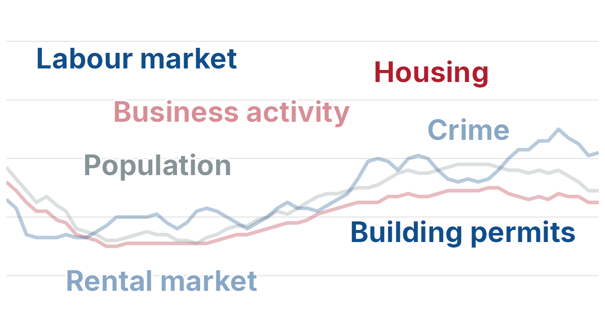

<!-- An announcement, not an analysis: no data, charts or R code, so the post
     template's data sections (Key terms, Data sources and reliability,
     Reproducibility) are left out. With no chart PNG, R/seo_post_render.R keeps
     images/card.png, already 1200 x 630, as the sharing picture. -->

[{fig-alt="The seven sections of the Vital Statistics page - Labour market, Housing, Business activity, Crime, Population, Building permits and Rental market - over faded lines of the unemployment rate for Waterloo Region, Ontario and Canada" style="aspect-ratio: 1200 / 560; object-fit: cover; object-position: bottom;"}](../../vital-statistics/index.qmd)

<!-- The style above shows the card without the top 70 of its 630 pixel rows,
     which are blank, so it sits closer to the author line; the file itself
     stays 1200 x 630 for link previews. -->

Looking for a handy overview of employment, business activity, housing, population, and crime in Waterloo Region? The new [Vital Statistics](../../vital-statistics/index.qmd) page is where to look. It contains a regularly updated collection of charts on the Region's health in each of these key areas, often with Ontario and Canada added for comparison. Most of the data used to produce these charts is updated monthly, so the page will be refreshed at least once a month to capture the latest statistics. The rental, population, and crime data is released annually, so those charts will only change once a year. You can find it any time under **Vital Statistics** in the menu at the top of every page. 

## What does it track?

The page monitors the Region's health in seven critical areas:

- **Labour market:** employment, labour force participation, unemployment, and Employment Insurance beneficiaries
- **Business activity:** business openings and closings
- **Building permits:** the value of residential and non-residential permits, and the number of dwelling units they create
- **Housing:** housing starts by type and by ownership, and new housing prices
- **Rental market:** vacancy rates, average rents, and the yearly change in rent
- **Population:** the number of residents, how fast it is growing, and where the growth comes from
- **Crime:** the Crime Severity Index and the number of police-reported incidents

Many of these areas will be analyzed in depth in posts of their own. If there's a statistic you'd like to see added, email me at [greg@chartingwaterlooregion.ca](mailto:greg@chartingwaterlooregion.ca).
